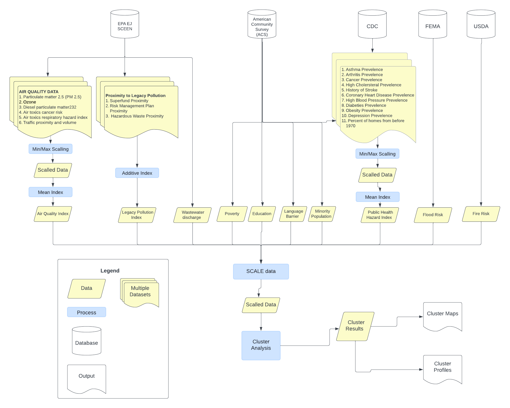

```{r setup, include=FALSE}
knitr::opts_chunk$set(echo = TRUE,warning=FALSE,message=FALSE)

library(tidyverse)
library(tigris)
library(sf)
library(httr2)
library(tidycensus)
library(sfdep)
library(RSocrata)
library(terra)
library(gridExtra)
library(corrr)
library(corrplot)
library(caret)
library(flexclust)
library(kableExtra)
library(viridis)
library(RColorBrewer)
library('ggthemes')
library(plotly)

options(tigris_use_cache = TRUE)

options(scipen = 999)

```

# Introduction

This project was completed as Capstone project for MUSA - 8020 Capstone Project/Advanced Topics In GIS. The project aims to explore how cluster analysis techniques, specifically k-means cluster analysis can be used to map and identify environmental justice areas, and group together areas that face similar vulnerabilities and risks.

# Existing Environmental Justice Mapping Initiatives

Over the past 10 years, there has been an increased focus on environmental justice in the United States. The Environmental Justice movement emerged because poor and/or marginalized communities have tended to harmed by hazardous waste, resource extraction, and other negative land uses from which the marginalized communities do not benefit. In recent years, the federal and state government has acknowledged that health and environmental burdens have tended to have a larger impact on marginalized communities and are putting in place programs to help environmentally burdened, marginalized communities. For example, the EPA has set up an Office of Environmental Justice and External Civil Rights (OEJECR) to coordinate efforts to integrate environmental justice into all policies, programs, and activities^[Environmental Protection Agency, Learn About Environmental Justice, https://www.epa.gov/environmentaljustice/learn-about-environmental-justice]. Additionally, the Biden Administration launched the Justice 40 initiative in 2022, this initiative sets a goal that 40% of federal climate, clean energy, affordable and sustainable housing projects fund projects go towards marginalized communities that have been overburdened by pollution^[The White House, Justice40, A whole of Government initiative, https://www.whitehouse.gov/environmentaljustice/justice40]. At the state level, many states are also requesting that grant requests for state funding consider environmental justice as part of the request. For example, the Pennsylvania Department of Environmental Protection (DEP) notes that many state grant project require communities to consider environmental justice as part of their grant proposal^[PA Department of Environmental Protection, Funding Opportunities, https://www.dep.pa.gov/PublicParticipation/OfficeofEnvironmentalJustice/Funding/Pages/default.aspx]. 

The growing interest in environmental justice, and targeted funding for environmental justice initiatives has result in a growing number of environmental justice related mapping initiatives. Environmental Justice Mapping, sometimes also refereed to as burdened community mapping seeks to identify areas with a high environmental burden that also contain poor and marginalized communities. Environmental Justice mapping aims to help decision makers identify areas eligible for funding through programs like Justice40 that are designed to target marginalized and environmental burdened communities. Existing Environmental Justice Mapping has primarily occured at the state and federal level. A study by University of Indiana identified 17 state level environmental justice mapping tools^[David Konisky, Daniel Gonzalex, Kelly Leatherman. 2021. Mapping for Environmental Justice: An Analysis of State Level Tools, Environmental Resilience Institute, Indian University.]. These tools vary in complexity but typically use a mix of socio-economic and demographic data like race, income, and education data, some of the tools also incorporate environmental data through the use of data on air quality and proximity to legacy pollution sites. Some state level tools just present the raw data, while other go a step further and built environmental justice index. The first state to develop an environmental justice index was California - the California index was first released in 2013 and since been updated multiple four times^[California Office of Environmental Health Hazard Assessment. 2013 CaleEnviroScreen 1.0. https://oehha.ca.gov/calenviroscreen/report-general-info/calenviroscreen-10]. Many other states including Pennsylvania and Michigan have developed similar indexes based on the methodology used in California. In Pennsylvania, the EJ index is called PennEnviroScreen and is based on thirty different indicators which are shown in the table below. The variables are divided into four different components and separate indexes are calculated for each component. The components are then merged together into a single index. The variables on the pollution burden side tend to be environmental variables, while the population characteristic variables refer to public health, demographic, and socioeconomic characteristics of the population.

```{r}

Environmental_Exposure_Component <- c('Ozone Levels','Diesel Particulate Matter','Toxic Air Emissions','Toxic Water Emissions','Pesticide Usage','Traffic Density','Compressor Stations','Children Lead Risk','')

Environmental_Effects_Component <- c('Fracking Wells','Conventional Oil and Gas wells','Railroad length','Land remediation sites','Hazardous Waste sites','Coal Mines','Impaired Water sites','Abandoned Mines','Municipal waste sites ')

Sensitive_pop_component = c('Asthma Prevalence','Population without health insurance','Cancer prevalence','Disabled Population','Coronary Heart Disease Prevalence','','','','')

Socioeconomic_component = c('High school degree','Population that does not speak English','Poverty Rate','Housing Burdened population','People of Color population','Unemployed population','Population over 65','Population under 5','')

cbind(Environmental_Exposure_Component,Environmental_Effects_Component,Sensitive_pop_component,Socioeconomic_component) %>%
  kbl(col.names = c('Environmental Exposure Component','Environmental Effects Component','Sensitive Pop Component','Socioeconomic Component'),caption = "Table 1: Variables Used PennEnviroScreen") %>%
  kable_minimal() %>%
  kable_styling('striped',stripe_color = "green") %>%
  add_header_above(header = c('Pollution Burden' = 2, 'Population Characteristic' = 2))

```

At the federal level, multiple agencies have also produced Environmental Justice mapping tools. The Agency of Toxic Substances and Disease Registry (ASTDR), which is overseen by the Center for Disease Control (CDC) has created an index called the Environmental Justice Index (EJI). The EJI uses a similar method to the Pennsylvania EJ Index discussed above, but relies only on federally available datasets including data from the U.S Census Bureau, The U.S Environmental Protection Agency, and the Center for Disease Control (CDC). The index includes 36 variables which are divided into three components. The three components are the Health Vulnerability Module, The Environmental Burden Module, and the Health Vulnerability Module. 

Another example of a federal tool is the Climate and Economic Justice Screening Tool, which is frequently called CJEST. CJEST was developed by the Council on Environmental Quality (CEQ), under an executive order from the Biden Administration and is designed to help identify disadvantages communities that can benefit from Justice40 funding. Like the EJI, the CJEST is also based on data from multiple different federal datasets. However, unlike the other products discussed, CJEST does not use an index approach. Instead it considers environmentally burdened communities to include any communities where any indicator included in CJEST is at or above the 90th percentile - the census tract must also be at or above the 65th percentile for low income. The CJEST product has received some criticism for not explicitly including race in the tool^[Drew Costley. Exclusion of race in federal climtae justice screening tool could worsen disparities, analysis says. 2023 Associated Press. https://apnews.com/article/environment-climate-pollution-biden-justice40-air-633392b2f4f50bbaaff8880746783966]. It has also been criticized for oversimplifying complex issues, and for failing to adequately identify and flag areas with compounding burdens^[Bob Dean and Paul Esling. CEJST is a simple map, with big implications – and attention to cumulative burdens matters. 2023. Center for Neighborhood Technology. https://cnt.org/blog/cejst-is-a-simple-map-with-big-implications-and-attention-to-cumulative-burdens-matters]. 

# Limitations of Existing Tools

The current approaches for environmental justice and burdened community mapping have some limitations. Firstly, both the index approach and the threshold approach used in CJEST make it challenging for decision makers to understand what is leading to an area being classified as an environmental justice area. Understanding this requires exploring the raw data, which decision makers may not allways have the time and/or skills to do this work. Additionally, all the tools discussed here have been developed at the state or national level and do not provide information that can be used to support regional planning across state boundaries. 

# Research Questions

My research focuses on two main questions. 

1) First I aim to explore how cluster analysis techniques, specifically k-means cluster analysis can be used for environmental justice mapping. Cluster analysis identifying groups of data that share similar characteristics. In my use case, I aim to identify census tracts that share similar health and socio-economic vulnerabilities and exposure to environmental hazards. The results of the cluster analysis should also be able to help identify clusters that experience similar compounding hazards and vulnerabilities.

2) I am aim to carryout my analysis at a regional scale, and will use a study areas that transcends states boundaries. The results of the cluster analysis, should allow decision makers to make comparisons across a larger region and support regional decision making which. This type of decision making is often challenging when using the existing tools.  


# Study Area

My study area is the Delaware River Basin, specifically the sections of the Basin located in Delaware, New Jersey, and Pennsylvania. The study area is shown in orange in the figure below.  I choose to examine a natural boundary like a watershed because environmental contamination does not respect political boundaries. Additionally, environmental planners are often interested in being able to analyze and make comparisons across a natural boundary such as a watershed. A cross-state analysis will also allow my results to be more useful for regional level planning and regional decision making. 

```{r study_area, results='hide'}

states1 <- states() %>%
  filter(STUSPS %in% c('PA','NJ','DE','NY','MD')) %>% st_transform(26918)

states2 <- states1 %>% filter(STUSPS %in% c('PA','NJ','DE'))

de_river_basin <- st_read('https://services8.arcgis.com/5Wj4rmM3lycu9Zo6/arcgis/rest/services/DRB_SAs/FeatureServer/0/query?f=geojson&where=1=1') %>%
  st_transform(26918)


study_area <- st_intersection(de_river_basin,st_union(states2))

```

```{r study_area_map}
ggplot()+
  geom_sf(data=study_area,color='transparent',fill='orange')+
  geom_sf(data=de_river_basin,color='lightblue', fill='transparent',linewidth=1.5)+
  geom_sf(data=states2,color='black',fill='transparent')+
  theme_void()

```

# Datasets

The table below shows the datasets which are included in my cluster analysis. In total 10 different variables will be included in the cluster analysis. I choose to rely on federal datasets in order to allow my research to be replicable in another geography. 

``` {r datasets}

Variable = c('Air Pollution Index','Proximity to Legacy Polluion','Water Quality','Flood Risk','Wildfire Risk','Minority Population','Poverty','Education','Language Barrier','Public Health Hazard Index')

Source = c('EPA EJ Screen','EPA EJ Screen','EPA EJ Screen','FEMA','USDA','American Community Survey, 2022','American Community Survey, 2022','American Community Survey, 2022','American Community Survey, 2022','CDC PLACES DATASET')

Notes = c('Index calculated based on Particulate Matter in Air, ozone, Disel Particulate Matter in Air, Cancer Risk from inflation of Air Toxics, and Tradffic Volume and Proximity','Calculated based on Proximity to superfund sites, proximity to risk management facilities, and Proxmity to hazardous waste facilities','Modeled toxic concentrations at stream segments within 500 meters','Percent of Tracts located in the FEMA Flood Plain','Wildfire Likelihood (Chance of Fire in Any Year)','% of population that is not white','% of households below poverty line','% of population over 25 without post-secondary degree','% of Households with limited English Profficiency','Index Calcuated based on % of 18+ population with the following chronic conditions: arthritis, cancer, high cholestrol, asthma, history of stroke, depression, Coronary Hear Diseas, Diabetes and Obesity')

cbind(Variable,Source,Notes) %>%
  kbl(caption = "Table 2: Variables Used in Cluster Analysis") %>%
  kable_minimal() %>%
  kable_styling('striped',stripe_color = "green")

```


# Methodology

The flow chart below shows my methods for carrying out this analysis. The schematic is intended to be a high level overview of the methods and data processing steps used. Additional annotations will be provided throughout the code to provide additional details on each step of the process. All data analysis occured at the census tract level.



# Data Wrangling

The first step in my process involve wrangling data from a variety of different federal databases. The federal databases used include data from the American Community Survey, CDC, EPA, FEMA, and USDA. I also engineer new variables through the creation of indexes and data scaling prior to carrying out cluster analysis.

## Census Data

Data from the U.S Census Bureau is downloaded from the American Community Survey (ACS) - specifically the five year ACS data for 2022 which is the most recent ACS data available. Data is downloaded using the tidycensus R package which provides easy access to census data. 

To download data, I first created a function that downloads data for variables of interest for a specified state, year, and geographic level. I use this function to download five year ACS data at the tract level for Pennsylvania, New Jersey, and Delaware. Percent data is not directly available from the ACS and it is thus necessary to calculate the percent of the population that is not white, the percent of households with limited English proficiency, the percent of the population without a university degree, and the percent of households below the poverty line. 

The formulas below specify the calculations for each variable originating from the ACS. The formulas specify the ACS census variables names used in the calculations. In all cases, the denominator used comes from the same ACS table as the numerator which is a practice the ACS recommends when calculating percents. It also important to note that the ACS data are not exact counts, but rather are estimates which represent the mid-point of a range.

* The Percent Minority Variable is calculated by dividing the white population by the total population multiplying by 100. The percent of the census tract population that is not white is then calculated.

$pct\_minority = 100 - (B02001\_002 / B02001\_001E * 100)$

* The percent of the population with limited English proficiency is calculated by summing together the number of households in a census tract who speak Spanish with Limited English Proficiency, Households who speak other Other Indo-European languages with limited English proficiency, households who speak Asian and Pacific Island languages with English limited, and households who speak other languages with limited English Proficiency. The total sum is then divided by the number of households in the census tract.

$pct\_nonenglish = (C1600\2_004E + C16002\_007E + C16002\_010E + C16002\_013E)/C16002\_001E * 100$

* The percent of the population over 25 without a university degree is calculated by summing together the population without a highschool degree and the population over 25 with just a high school degree and no university degree. This sum is then divided by the total population over 25 to determine the percent.

$pct\_nouniversity = (B06009\_002E + B06009\_003E)/B06009\_001E * 100$

* The percent of the census tract population below the poverty line is calculated by dividing the census tract population that is below the poverty line by the total population of the census tract.

$pct\_poverty =  (B06012\_002E / B06012\_001E * 100)$


```{r census_data, results='hide'}

#Income, #Language, #Education, #Percent of Income on Rent

vars <- c('B02001_001', #Total Population
          'B02001_002', #White Only
          'C16002_004', #Spanish, Limited English
          'C16002_007', #Other Indo-European languages:!!Limited English speaking household
          'C16002_010', #Asian and Pacific Island languages:!!Limited English speaking household
          'C16002_013', #Estimate!!Total:!!Other languages:!!Limited English speaking household
          'C16002_001', #Total
          'B06009_002', #Less than graduate degree
          'B06009_003', #High School Graduate
          'B06009_001', #Total
          'B06012_002',
          'B06012_001')

process_acs <- function(state,level,vars,year){
  census_data <- tidycensus::get_acs(level,
                        variables = vars,
                        year = year,
                        state = state,
                        geometry = TRUE,
                        output = 'wide') %>%
    dplyr::select(ends_with('E'),GEOID)
  }

census_tract <- rbind(process_acs('DE','tract',vars,2022),process_acs('PA','tract',vars,2022),process_acs('NJ','tract',vars,2022)) %>%
  st_transform(26918) %>%
  mutate (pct_minority = 100 - (B02001_002E / B02001_001E * 100),
            pct_non_english = (C16002_004E + C16002_007E + C16002_010E + C16002_013E)/C16002_001E * 100,
            pct_no_university = (B06009_002E + B06009_003E) / B06009_001E * 100,
            pct_poverty =  (B06012_002E / B06012_001E * 100),
            total_pop = B02001_001E)
```

I filter the census data to only include census tracts located in my study area. My analysis includes all census tracts in Delaware, New Jersey, and Pennsylvania that have a centroid located within my study area.

```{r identify_basin_tracts}

basin_tracts <- st_centroid(census_tract) %>%
  st_intersection(., study_area) %>%
  dplyr::select(GEOID,NAME,pct_minority,pct_non_english,pct_poverty,pct_no_university,total_pop) %>%
  st_drop_geometry() %>%
  left_join(.,census_tract %>% dplyr::select (GEOID,geometry),by='GEOID') %>%
  st_as_sf()

```


## EPA EJ Screen Data

Data on Air Quality, Proximity to Legacy Pollution, and Waste Water Conditions is downloaded from the EPA Environmental Justice Screen dataset. The EPA EJ Screen dataset provides data for 13 environmental indicators and data is made available at the census tract level. I download the data for Pennsylvania, Delaware, and New Jersey using an API request to a feature service hosted on ArcGIS Online. In my API request, I include parameters such that the API response only returns data for census tracts in Pennsylvania, Delaware, New Jersey and the response only includes the specific variables I plan to use in my analysis.

```{r ej_screen, results='hide'}

url <- httr2::url_parse("https://services.arcgis.com/cJ9YHowT8TU7DUyn/ArcGIS/rest/services/EJScreen_StatePctiles_with_AS_CNMI_GU_VI_Tracts/FeatureServer/0/query")

url$query <- list(
  where = "ST_ABBREV IN ('PA','DE','NJ')",
  outFields = "ID,STATE_NAME,CNTY_NAME,PM25,OZONE,DSLPM,CANCER,RESP,PTRAF,PNPL,PTSDF,PRMP,PWDIS",
  returnGeometry = "false",
  f = "json"
)

final_url <- httr2::url_build(url)

epa_data <- sf::st_read(final_url)
  
```

I perform several data manipulation steps to create a single index from related environmental variables. 

**Legacy Pollution**

The EJ Screen data includes three legacy pollution variables:

* Proximity to superfund sites (PNPL)
* Proximity to risk management plan facility site (PRMP)
* Proximity to Hazardous Waste Sites (PTSDF)

EJ Screen calculates all three variables as the count of the number of locations within 5 kilometers of the census tract, each divided by the distance from the census tract in kilometers. If there are no sites located within 5 kilometers the nearest site beyond 5 kilometer is used. Since the units for all three variables is the same the variables can be added to together to create a single index. 

**Wastewater Discharge**

The EJ Screen on Waste Water Discharge is calculated using the EPA's Risk-Screening Environmental Indicators (RSEI) Dataset. This dataset includes data on toxic emissions from industrial facilitates. The EPA EJ Screen product calculates as the sum of RSEI modeled toxic concentrations at streams located within 500 meters of each census tract centroid, and each facility is weighted by the distance in kilometers (km) from the centroid. The raw data for the Delaware Basin has a very strong left skew as shown in the chart below with the majority of census tract having values lower than 50. However, there are several tracts that are very significant outliers with the highest value being 3928. 

In order to work around this challenge, I decide to convert the data to percentile which is the approach EJ Screen uses to present this data. The percentiles range from 0 to 100% with a median at the 50th percentile. When calculating the percentiles I only consider census tracts located in my study area.

**Air Quality**

I also create an air quality index, based on six air quality variables included in EJ Screen. The methodology for Air quality index will be discussed in more detail in the next section. 

```{r}

hist(epa_data$PWDIS,breaks=300)

```

```{r}
epa_data <- epa_data %>%
  st_drop_geometry() %>% 
  rename(GEOID = ID) %>% 
  rename(AIR_CANCER = CANCER) %>%
  rename(Wastewater = PWDIS)

```

## CDC Public Health Data

The analysis also includes a public health index, calculated based on Data from the CDC Places Dataset and one variable from the American Community Survey. The PLACES dataset contains model-based census tract public health estimates. The specific variables included in my index are: Percent of Population with Arthritis, Percent of Population with Cancer, Percent of Population with Asthma, Percent of Population with High Cholesterol, Percent of Population with Depression, Percent of Population with history of stroke, Percent of Population with Obesity, Percent of Population with Diabetes, Percent of Population with Chronic Heart Disease. Data on the Percent of Homes in the census tract that were built before 1960 comes from ACS.

CDC Places data for Pennsylvania, Delaware, and New Jersey is downloaded using the CDC API. Data on the percent of homes build before 1960 is downloaded from the census API using tidycensus. After merging the CDC and ACS data into a single dataframe, I idenify the tacts which overlap my study area and create a data frame that only includes the tracts in my study area. 

```{r cdc_places}

places_pa <- read.socrata('https://data.cdc.gov/resource/cwsq-ngmh.csv?stateabbr=PA')
places_de <- read.socrata('https://data.cdc.gov/resource/cwsq-ngmh.csv?stateabbr=DE')
places_nj <- read.socrata('https://data.cdc.gov/resource/cwsq-ngmh.csv?stateabbr=NJ')

home_vars = c('B25034_001','B25034_011','B25034_010','B25034_009')

home_data <- rbind(process_acs('DE','tract',home_vars,2019),process_acs('PA','tract',home_vars,2019),process_acs('NJ','tract',home_vars,2019)) %>%
  st_transform(26918) %>%
  mutate (pct_old_homes = (B25034_011E + B25034_010E + B25034_009E) / B25034_001E * 100) %>%
  select(pct_old_homes, GEOID) %>%
  st_drop_geometry()

all_places <- rbind(places_pa,places_de,places_nj) %>%
  filter(category == 'Health Outcomes') %>%
  pivot_wider(id_cols='locationname',names_from='measureid',values_from='data_value') %>%
  rename(GEOID = locationname) %>%
  mutate(GEOID = as.character(GEOID)) %>%
  dplyr::select(GEOID,ARTHRITIS,CANCER,CASTHMA,HIGHCHOL,DEPRESSION,STROKE,OBESITY,DIABETES,CHD) %>%
  left_join(.,home_data,by='GEOID')

tracts2010 <- rbind(tracts(state='PA',year=2019),tracts(state='DE',year=2019),tracts(state='NJ',year=2019)) %>% st_transform(26918)

cpc_basin <- tracts2010 %>%
  st_centroid() %>%
  st_intersection(., study_area) %>%
  st_drop_geometry() %>%
  left_join(.,tracts2010 %>% dplyr::select (GEOID,geometry),by='GEOID') %>%
  st_as_sf() %>%
  select('STATEFP','GEOID','geometry') %>%
  left_join(.,all_places,by='GEOID') %>%
  drop_na()

  
```

# Exploratory Data Analysis

I carryout exploratory analysis to better understand the spatial patterns and correlations between the variables which will be included in my analysis. I also create a public health index from the public health variables and the air quality variables.

## CDC Public Health Data

The correlation matrix below shows the pearson correlation matrix between the public health variables from the CDC and old homes variable from the ACS. As shown, there is a high degree of correlation between multiple variables. For example, the pearson correlation between Arthritis and Coronary Health Disease (CHD) is 0.87. It is generally not advisable to include highly correlated variables in a cluster analysis. Additionally, includes 10 public health variables would result in a cluster analysis model that places too heavy of an emphasis on public health. As a solution to these challenges, I develop a public health index based on the ten public health related variables.   

``` {r correlation_cdc}

cpc_basin %>% 
  st_drop_geometry() %>%
  dplyr::select(ARTHRITIS,CANCER,CASTHMA,HIGHCHOL,DEPRESSION,STROKE,OBESITY,DIABETES,CHD,pct_old_homes) %>%
  drop_na() %>%
  cor() %>%
  corrplot(addCoef.col = "black", number.cex = 0.7)

ggsave('outputs/cdc_plot.png')

```
I explore two different approaches for creating an index. 

The first, is a simple index calculated as a mean of all ten variables. Prior to calculating the mean I use min-max scaling technique to scale all ten variables between 0 and 1 so that all variables have the same range. The mean scaled values for each census tract is then calculated and the resulting index is again scaled using min max scaling so that the final values range between zero and one.  


``` {r cdc_index}
cpc_no_geom <- cpc_basin %>%
  st_drop_geometry() %>%
  dplyr::select(ARTHRITIS,CANCER,CASTHMA,HIGHCHOL,DEPRESSION,STROKE,OBESITY,DIABETES,CHD,pct_old_homes)

process <- preProcess(cpc_no_geom, method=c("range"))

health_index <- predict(process, cpc_no_geom) %>% rowMeans() 

min <- min(health_index)

max <- max(health_index)

health_hazard_index <- (health_index - min) / (max - min) 
                      
cpc_basin <- cbind(cpc_basin,health_hazard_index)
```

The second approaches involves using principle component analysis. Using principle component analysis (PCA) to create an index is a common technique. An example is Susan Cutter's Social Vulnerability Index where PCA was used to create vulnerability index from 42 variables^[Cutter, S.L., Boruff, B.J. and Shirley, W.L. (2003), Social Vulnerability to Environmental Hazards†. Social Science Quarterly, 84: 242-261. https://doi.org/10.1111/1540-6237.8402002]. PCA was used to reduce the number of variables from 42 to 11 variables. The resulting 11 component variables were summed together to create a single index.

My analysis replicates this approach, and run PCA on the ten public health related variables. The table below shows the proportion of variance explained by each component and the cumulative proportion explained by retaining the cumulative number of components. For example, if PC1 and PC2 were retained 75.96% of the variation in the data would be explained. I decide to retain five components as this will explain 96.22% of the variance in the data.  

``` {r cdc_index2}

#Retain Four Components

pca <- prcomp(cpc_no_geom,center=TRUE,scale=TRUE)

summary(pca)

```
The final PCA index is calculated by summing together the five component values. I use min max scalling to scale the index between 0 and 1 to allow for easier comparisions between the PCA index and the simpler mean index. 

``` {r cdc_index2_countinued}

pca_index2<- pca$x[,1:5] %>% as_data_frame() %>%
  mutate(PC1 = PC1 * -1,
         PC2 = PC2 * -1,
         PC3 = PC3 * -1,
         PC4 = PC4 * -1,
         PC5 = PC5 * -1) %>% 
  rowSums()

min <- min(pca_index2)

max <- max(pca_index2)

pca_index2 <- (pca_index2 - min) / (max - min) 

cpc_basin <-cbind(cpc_basin,pca_index2)

```

The maps below show the two indexes calculated for the study area. I decided to use the simpler averaging index for the cluster analysis as the averaging index displays a greater variance in index values. Additionally, using PCA results in removing multicollinearity between variables. This multicollinearity is important to capture to ensure the final health hazard index captures comorbidities between chronic health conditions. 

``` {r cpc_map}

boundings <- st_bbox(basin_tracts)
xmin = boundings[1]
ymin = boundings[2]
xmax = boundings[3]
ymax = boundings[4]

states_map <- states1 %>% erase_water(area_threshold=0.99)

p1 <- ggplot()+
  geom_sf(data=states_map,fill='gray95',color='transparent')+
  geom_sf(data=cpc_basin,aes(fill= health_hazard_index),linewidth=0.2,color='transparent')+
  scale_fill_distiller(palette = 'RdYlGn')+
  geom_sf(data=states1,fill='transparent',color='gray10',linewidth=0.5)+
  xlim(xmin,xmax)+
  ylim(ymin,ymax)+
  ggtitle("Health Hazard Averaging Index")+
  theme_void()+
  theme(panel.background = element_rect(fill = '#d3f6ff',color='transparent'))

p2 <- ggplot()+
  geom_sf(data=states_map,fill='gray95',color='transparent')+
  geom_sf(data=cpc_basin,aes(fill=pca_index2),linewidth=0.2,color='transparent')+
  scale_fill_distiller(palette = 'RdYlGn')+
  geom_sf(data=states1,fill='transparent',color='gray10',linewidth=0.5)+
  xlim(xmin,xmax)+
  ylim(ymin,ymax)+
  theme_void()+
  ggtitle("Health Hazard PCA Index")+
  theme(panel.background = element_rect(fill = '#d3f6ff',color='transparent'))

grid.arrange(p1,p2,nrow=1)

ggsave('outputs/health.png')

```

## Join Together CPC, EPA, and Census Data

The next involves joining together the derived Public Health Index Data, EPA EJ Screen Data, and variables from the ACS into a single spatial dataframe. This is done by joining the datasets based on the GEOID column. 

One challenge is that the EPA and Census datasets use the 2020 census tract boundaries, while the CDC index is calculated using 2010 census tract boundaries. Due to changes in boundaries it is not possible to join these two datasets together. To address this challenge, I use a cross-walk table provided the census bureau that includes information on the overlapping area between 2010 census tract boundaries and the 2020 census tract boundaries. I join the index data to the cross-walk table and then calculated a weighted average index value for each of the 2020 census tracts, using the percent overlap between the 2020 and 2010 census tract as the weight.  

```{r join_data}

basin_tracts_2 <- left_join(basin_tracts,epa_data,by='GEOID') %>% #Join tracts to EPA data
  filter(total_pop > 0) %>% #Remove tracts with no population
  mutate(pct_non_english = ifelse(is.nan(pct_non_english),NA,pct_non_english), #Turn nan to NA where denominator was zero.
         pct_poverty = ifelse(is.nan(pct_poverty),NA,pct_poverty)) %>% #Turn nan to NA where denominator was zero.
  mutate(waste_proximity = PNPL + PTSDF + PRMP,
         Wastewater = percent_rank(Wastewater)) %>%
  select(-PNPL, -PTSDF, -PRMP)

boundary_changes <- read.csv('Data/Boundary_Changes.csv') 

basin_tracts_2 <- boundary_changes %>%
  select(GEOID_TRACT_20,AREALAND_TRACT_20,GEOID_TRACT_10,AREALAND_TRACT_10,AREALAND_PART) %>%
  mutate(pct20 = round(AREALAND_PART / AREALAND_TRACT_20,2),
         GEOID_TRACT_10 = as.character(GEOID_TRACT_10),
         GEOID_TRACT_20 = as.character(GEOID_TRACT_20)) %>% 
  right_join(.,cpc_basin %>% select(health_hazard_index,GEOID),by=join_by(GEOID_TRACT_10==GEOID)) %>%
  mutate(weighted_index = round(pct20 * health_hazard_index,2)) %>%
  st_drop_geometry() %>%
  group_by(GEOID_TRACT_20) %>% 
  summarise(health_hazard_index = sum(weighted_index)) %>%
  rename(GEOID = GEOID_TRACT_20) %>%
  left_join(basin_tracts_2,.,by='GEOID')

basin_tracts_2_4269 <- basin_tracts_2 %>% st_transform(4269)
```

## Air Quality Data Analysis

As discussed previously, I also develop an air quality index based on multiple air quality related variables from the EJ Screen dataset. The correlation matrix below shows the pearson correlation value for the relationship between each of the air quality variables. The five air quality related variables are:

* Annual average PM2.5 levels in air (PM25) measured in micrograms per cubic meter.
* Average of the annual top ten daily maximum 8-hour ozone concentrations in air (OZONE) in parts per billion
* Diesel particulate matter level in air (DSLPM) in micrograms per cubic meter. 
* Ratio of exposure to air toxics compared to health-based reference concentration (RESP)
* Traffic Proxmity and Volume (PTRAF), calculated as count of vehicles (i.e: average annual daily traffic) at major roads within 500 meters, roads are weighted divided by distance in meters.

As shown, there is a high correlation between Diesel Particulate Matter in the Atmosphere (DSPLM) and Ozone in the air. There is also a high correlation between DSPLM variables and exposure to air toxics compared to health-based references (RESP). Including variables with a high pearson correlation in a cluster analysis would not be appropriate.

``` {r correlation_pollution}
basin_tracts_2 %>% 
  st_drop_geometry() %>%
  dplyr::select(PM25,OZONE,DSLPM,RESP,PTRAF) %>%
  correlate() %>% 
  autoplot() +
  geom_text(aes(label = round(r,digits=2)), size = 3.5, order = "hclust", type = "upper", tl.cex = 3)

ggsave('outputs/corplot1.png')

```

The maps below show five maps for each of the air quality related variables. As shown, all variables display a high degree of autocorrelation, and areas with poor air quality tend to be clustered in space. The maps also help show the multicolineraity between the air quality variables. For example, areas near Philadelphia tend to have higher values for all air quality related variables. 

```{r,fig.width=8,fig.height=6}

create_map1 <- function(col,t){
  ggplot()+  
    geom_sf(data=states_map,fill='gray95',color='transparent')+
    geom_sf(data=basin_tracts_2,aes(fill={{col}}),color='transparent')+
    scale_fill_viridis_c(option='rocket',direction=-1)+
    geom_sf(data=states1,fill='transparent',color='gray20',linewidth=0.5)+
    xlim(xmin,xmax)+
    ylim(ymin,ymax)+
    theme_void()+
    theme(panel.background = element_rect(fill = '#d3f6ff',color='transparent'))+
    labs(title = t)
}

m1 <- create_map1(PM25,'Particulate Matter')
m2 <- create_map1(OZONE,'Ozone')
m3 <- create_map1(DSLPM,'Disel Particulate Matter')
m4 <- create_map1(RESP,'Respiratory Hazard Index')
m5 <- create_map1(PTRAF,'Traffic Proximity and Volume')

grid.arrange(nrow=2,m1,m2,m3,m4,m5)

g <- arrangeGrob(nrow=2,m1,m2,m3,m4,m5) #generates g

ggsave('outputs/air.png',g)

```

I develop an air quality index to avoid including multiple highly correlated variables in the cluster analysis. The air quality index is calculated by min max scalling all variables, so that all variables range from 0-1 and then calculating the mean of all variables. This results in a final index that ranges from 0.00005 to 0.67. 

``` {r pollution_index}

basin_air_no_geom <- basin_tracts_2 %>%
  st_drop_geometry() %>%
  dplyr::select(PM25,OZONE,DSLPM,RESP,PTRAF)

process <- preProcess(basin_air_no_geom, method=c("range"))

air_index <- predict(process, basin_air_no_geom) %>% rowMeans() 

basin_tracts_2 <- cbind(basin_tracts_2,air_index)
```

The map shows the resulting air quality index for the study area. Areas with the highest index value are located in the Philadelphia metro area and near Allentown, Pennsylvania.  

```{r}

create_map1(air_index,'Air Index')

ggsave('outputs/air_index.png',width=3.1,height=5)

```

## Census Analysis

The maps below show census tract level for the four demographic and socio-economic variables from the American Community Survey included in the analysis. As shown, the percent of the population that is a minority is highest in census tracts North and West Philadelphia. Other areas with a large minority population include parts of Monroe county and areas near Wilmington and Dover in Delaware. The census tracts where a large percent of the population has a language barrier are spatially clustered, notable areas with clusters include the Philadelphia metro area, areas of Southern New Jersey, and areas near Allentown, Pennsylvania.

The percent of the population living bellow the poverty line tends to be highest in census tracts located in urban areas, such as Camden, Philadelphia and Wilmington. Exceptions to this trend include areas like Northeast and Center City Philadelphia where the poverty rate is low. Suburban areas tend to have the lowest percent of the population below the poverty line, while rural areas such as Northern Pennsylvania and Southern Pennsylvania tend to have a poverty rate that falls somewhere in between the urban and sub-urban areas.  

```{r demographic_map, fig.width=10,fig.height=6}

create_map2 <- function(col,t){
  ggplot()+  
    geom_sf(data=states_map,fill='gray95',color='transparent')+
    geom_sf(data=basin_tracts_2,aes(fill={{col}}),color='transparent')+
    scale_fill_viridis_c(option='viridis',direction=-1,name='Percent')+
    geom_sf(data=states1,fill='transparent',color='gray20',linewidth=0.5)+
    xlim(xmin,xmax)+
    ylim(ymin,ymax)+
    theme_void()+
    theme(panel.background = element_rect(fill = '#d3f6ff',color='transparent'))+
    labs(title = t)
}


m1 <- create_map2(pct_minority,'Minority Pop.')
m2 <- create_map2(pct_non_english,'Language Barrier')
m3 <- create_map2(pct_poverty,'Poverty')
m4 <- create_map2(pct_no_university,'No University Degree')


grid.arrange(nrow=1,m1,m2,m3,m4)

g <- arrangeGrob(nrow=1,m1,m2,m3,m4) #generates g

ggsave('outputs/socio_demographics.png',g)


```

# Hazard Data

Next, I analyze data on Natural Disasters. I choose to focus on flood risk and fire risk as these are two of the main hazards that can impact areas of the Delaware River Basin. In the future additional hazards such as Winter Weather Risk and/or Exposure to Extreme Temperatures. 

## Flood Risk

Flood Risk is a major issue in the Delaware River as the basin includes multiple areas that are located near Water Bodies. The Water Bodies that overlap the study area include the Delaware Bay and River, and smaller rivers such as the Brandywine, Schuylkill, and Lehigh rivers. This analysis uses data on the Flood Hazard area published by the Federal Emergency Management Agency (FEMA). An important limitation to note is that FEMA flood mapping only considers river and costal flooding, the data does not capture flooding from urban drainage systems or pluvial flooding. Additionally, it is also important to note that FEMA flood mapping does not capture the impacts of sea level rise.

This analysis calculates the percentage of each census tract that is located within the Delaware River Basin. Data on the Flood Hazard Area in Pennsylvania, New Jersey, and Delaware was downloaded from the FEMA website and intersected with the study area in order to select just the parts of the floodplain that are located within the study area. 

```{r flood_plain, cache=TRUE, eval=FALSE}

PA_flood <- st_read('Data/PA_Flood_Hazard_Zone.shp') %>%
  .[st_intersects(.,basin_tracts_2_4269) %>% lengths > 0, ]

NJ_flood <- st_read('Data/NJ_Flood_Hazard_Zone.shp')  %>%
  .[st_intersects(.,basin_tracts_2_4269) %>% lengths > 0, ]

DE_flood <- st_read('Data/DE_Flood_Hazard_Zone.shp')  %>%
  .[st_intersects(.,basin_tracts_2_4269) %>% lengths > 0, ]
```

Next, the portion of the census tracts that permanently contain water were erased from the census tract. This was done to ensure that the calculation for the percent of the census tract located within the flood plain does not include area that is permanent water. 

The floodplain data was also transformed into the appropriate projection and dissolved into single part polygons to help expedite the spatial intersection process. Finally, the census tracts with the water erased and the floodplain are intersected together and the area of the census tract located within in the floodplain is calculated. The percentage is calculated by dividing the area within the floodplain by the total area of the census tract and the resulting percentage is appended to the dataframe containing the census tracts in the study area. 

Note that the code below, and the previous code chunk will take a longtime to run as performing spatial intersections in R is time and memory intensive. When replicating this analysis it it is recommended these two code chunks be run once and the results outputted to a .csv for future use. 

```{r flood_plain2, cache=TRUE, eval=FALSE}

basin_tracts_3 <- basin_tracts_2 %>% erase_water()

flood_study_area <- rbind(PA_flood,DE_flood,NJ_flood) %>% 
  st_transform(26918) %>%
  st_union(.) %>%
  st_cast(.,"POLYGON") %>% st_as_sf() %>% 
  rename(geometry = x)

tracts_flood <- st_intersection(basin_tracts_3,flood_study_area) %>%
  mutate(area = st_area(.)) %>%
  st_drop_geometry() %>%
  group_by(GEOID) %>% summarise(flood_area = sum(area)) %>%
  mutate(flood_area = as.numeric(flood_area) / 1000000)

basin_tracts_4 <- basin_tracts_3 %>%
  left_join(.,tracts_flood,by='GEOID') %>%
  mutate(flood_area = ifelse(is.na(flood_area),0,flood_area),
         area = (as.numeric(st_area(.)) / 1000000),
         flood_pct = flood_area / area * 100) %>%
  st_drop_geometry() %>%
  dplyr::select(GEOID,flood_pct) %>%
  right_join(.,basin_tracts_2,by='GEOID') %>%
  st_as_sf()


```


```{r, echo=FALSE}

basin_tracts_3 <- basin_tracts_2 %>% erase_water()

tracts_flood <- read.csv('data/flood.csv') %>%
  mutate(GEOID = as.character(GEOID))

basin_tracts_4 <- basin_tracts_3 %>%
  left_join(.,tracts_flood,by='GEOID') %>%
  mutate(flood_area = ifelse(is.na(flood_area),0,flood_area),
         area = (as.numeric(st_area(.)) / 1000000),
         flood_pct = flood_area / area * 100) %>%
  st_drop_geometry() %>%
  dplyr::select(GEOID,flood_pct) %>%
  right_join(.,basin_tracts_2,by='GEOID') %>%
  st_as_sf()
```

The map below shows the percentage of each census tract that is located within the flood plain. As shown the census tracts with the highest percentage of area located in the flood plain tens to be located along the Delaware River Bay in coastal areas of New Jersey and Delaware. 

``` {r flood_map}

ggplot()+
  geom_sf(data=states_map,fill='gray95',color='transparent')+
  geom_sf(data=basin_tracts_4,aes(fill=flood_pct),color='transparent')+
  scale_fill_viridis_c(option='mako',direction=-1,name='Pct. of Tract in Flood Plain')+
  geom_sf(data=states1,fill='transparent',color='gray20',linewidth=0.5)+
  xlim(xmin,xmax)+
  ylim(ymin,ymax)+
  theme_void()+
  theme(legend.position="bottom")+
  theme(panel.background = element_rect(fill = '#d3f6ff',color='transparent'))

ggsave('outputs/flood.png')
```

## Fire Risk

Wildfires are another hazard which can impact the Delaware River Basin. While Wildfire risk is low relative to Western and Central areas of the United States, they are still a hazard which can sometimes impact localized areas of the basin. Areas of the Delaware River Basin with the highest wildfire risk are located in New Jersey pine barrens and along the Delaware River Bay Coastline. 

The data on fire risk used in the analysis is obtained from the United States Department of Agriculture (USDA) Forest Service, which makes available a national 30 x 30 meter on the probability of a fire occurring in any year^[Scott, Joe H.; Gilbertson-Day, Julie W.; Moran, Christopher; Dillon, Gregory K.; Short, Karen C.; Vogler, Kevin C. 2020. Wildfire Risk to Communities: Spatial datasets of landscape-wide wildfire risk components for the United States. Fort Collins, CO: Forest Service Research Data Archive. https://doi.org/10.2737/RDS-2020-0016]. The product used is called the 'WildFire Likelihood".

State level raster tif files for Delaware, Pennsylvania, and New Jersey were downloaded from the [wildfire.org](wildfire.org), and then mosiaced together and re projected using the R Terra package. Zonal statistic extraction tools were then used to calculated the mean wildfire likelihood for each census tract and the mean value is appended to the dataframe containing the census tracts in the study area. 

The code below also takes a bit of time to run. When replicating this analysis it is recommended the code below be run once and the zonal statistics results be saved to a csv file for future use. 

```{r fire_risk,eval=FALSE}

# Load raster data for different states
raster_pa <- rast("Data/Fire/BP_PA.tif")
raster_de <- rast("Data/Fire/BP_DE.tif")
raster_nj <- rast("Data/Fire/BP_NJ.tif")

# Merge raster data into a single raster layer
merged_raster <- terra::mosaic(raster_pa, raster_de, raster_nj)

merged_raster <- project(merged_raster,"epsg:26918")

zone_values <- terra::extract(merged_raster, basin_tracts_4, method="simple", fun = mean, na.rm = TRUE)

basin_tracts_4 <- basin_tracts_4 %>%
  mutate(fire = zone_values$BP_PA * 100) %>%
  drop_na()
```

```{r fire_risk_join, echo= FALSE}

zone_values <- read.csv('Data/fire.csv')

basin_tracts_4 <- basin_tracts_4 %>%
  mutate(fire = zone_values$BP_PA * 100) %>%
  drop_na()
```

The map below shows the resulting fire risk for census tracts in the Delaware River Basin. The majority of census tracts in the basin have a very low wildfire risk. The census tracts with the highest wild fire risk are spatially clustered along the Delaware river basin coastline and in Central areas of New Jersey. Additionally, there is also a localized area of Northeastern Pennsylvania that has a higher wildfire risk.  

```{r fire_map}

ggplot()+
  geom_sf(data=states_map,fill='gray95',color='transparent')+
  geom_sf(data=basin_tracts_4,aes(fill=fire),linewidth=0.2,color='transparent')+
  scale_fill_viridis_c(option='inferno',direction=-1,name='% Likelihood of a WildFire')+
  geom_sf(data=states1,fill='transparent',color='gray10',linewidth=0.5)+
  xlim(xmin,xmax)+
  ylim(ymin,ymax)+
  theme_void()+
  theme(legend.position="bottom")+
  theme(panel.background = element_rect(fill = '#d3f6ff',color='transparent'))

ggsave('outputs/wildfire.png')


```
# Clustering

Having consolidated all variables of interest into a single data frame that includes all the census tracts in the basin, the next stage is to proceed with carrying out cluster analysis. This analysis uses k-means cluster analysis algorithm. The K-means algorithm is often used for large data sets with numeric variables. The method uses an iterative process that creates a division of objects into non-overlapping subsets (clusters) such that each object is in exactly one cluster. Before the six-step K-means process is initiated, the total number of clusters (K) must be specified. K-means cluster analysis algorithm does not consider spatial location as part of the analysis. However, the resulting cluster results can be joined to the census tract boundaries in order to create maps of the results.  

## Pre Processing

The first step is to pre process the data. K-means cluster analysis requires that all variables use in the analysis have the same unit. I choose to scale my data using min-max scaling which is a common form of scaling used to pre process data prior to carrying out cluster analysis. Min max scaling scales the values for all variables between 0 and 1. The highest value for a variable is assigned a value of one, while the lowest value is assigned a value for 0. The formula for min/max scaling is:

$\frac{(Value - Min\_value)}{(Max\_value - Min\_value)}$

``` {r create_basin_tracts}
basin_tracts_final <- basin_tracts_4 %>%
  select(flood_pct, pct_minority, pct_non_english, pct_poverty, pct_no_university, air_index, health_hazard_index, fire, waste_proximity, Wastewater) %>%
  st_drop_geometry() %>%
  drop_na()

process <- preProcess(basin_tracts_final, method=c("range"))

basin_tracts_final_scalled <- predict(process, basin_tracts_final)

```

## Cluster Analysis

After scaling the values we examine a correlation matrix to ensure that there is no severe multicollinearity between the final variables that will be included in the cluster analysis. The correlation matrix below uses the Pearson correlation coefficient. As shown, the correlation coefficient for all variables is bellow 0.7, indicating that there is no severe multicollineraity between the variables that will be used in the analysis. Additionally, viewing the correlation matrix also allows us to observe that the majority of variables included in the cluster analysis are positively correlated with each other.

```{r}

basin_tracts_final_scalled %>% 
  st_drop_geometry() %>%
  correlate() %>% 
  autoplot() +
  geom_text(aes(label = round(r,digits=2)), size = 2.5, order = "hclust", type = "upper", tl.cex = 3)

```
In K-means cluster analysis the analyst must specify the target number of cluster to create. There are many different approaches and statistical techniques for determine the optimal number of clusters. The approach I choose to use involves examining a scree plot. The scree plot plots the number of clusters against the Sum of Square Error at each cluster number. The plot is interpreted by trying to located the "elbow", or point where the drop off in the within group Sum of Squares Error to the next number of clusters is small compared to the previous number of clusters. 

As shown in the scree plot below, running a cluster analysis using 1 to 25 clusters on the data for the tracts in the Delaware river basin indicates that the within group sum of square error decreases when a k value of six and a k-value of nine. After examining the cluster analysis results when using a k value of six and k value of nine I decide to present a nine cluster solution. Using the larger nine cluster solutions results in clusters that have greater distinct characteristics and also creates a cluster with a high flood risk. The five cluster solution did not create a solution with a high flood risk.  

```{r cluster_analysis}
set.seed(789)

wss <- c()
for (i in seq(from=2,to=25,by=1)) wss[i] <- sum(kmeans(basin_tracts_final_scalled, centers=i, nstart=25)$withinss)

bind <- cbind(clusters = seq(from=1,to=25,by=1),wss) %>%
  as.data.frame() %>%
  dplyr::filter(clusters > 1) %>%
  mutate(wss_change = wss - lag(wss))

ggplot(data=bind)+
  geom_line(aes(x=clusters,y=wss),linewidth=0.5,color='gray60')+
  geom_point(aes(x=clusters,y=wss),size=1.5,color='gray60')+
  geom_point(data = bind %>% filter(clusters == 9),aes(x=clusters,y=wss,label=clusters),size=2.5,color='red')+
  geom_text(data = bind %>% filter(clusters != 9),aes(x=clusters + 0.2,y=wss + 10,label=clusters),size=3,color='gray60')+
  geom_text(data = bind %>% filter(clusters == 9),aes(x=clusters + 0.3,y=wss + 15,label=clusters),size=5,color='red')+
  scale_x_continuous(breaks=seq(from=2,to=25,by=1))+
  labs(x='Number of Clusters',y='Within groups sum of squares')+
  theme_bw()+
  theme(panel.border = element_blank(),panel.grid.major.x= element_blank(),panel.grid.minor = element_blank(),axis.text.x = element_blank(),axis.ticks.x = element_blank())

```
## Cluster Results

The interactive map below shows the cluster results for when using a k-value of nine. As shown, there is generally spatially clustering present in the location of clusters. Additionally, clusters tend to form along urban, suburban, and rural divides. For example, cluster nine is primarily rural while clusters six and two are primarily sub-urban. Clusters one and four are primarily urban.

```{r cluster_map}
set.seed(789)

pal = c('#8dd3c7','#ffffb3','#bebada','#fb8072','#80b1d3','#fdb462','#b3de69','#fccde5','#d9d9d9','#bc80bd')

clusters <- kmeans(basin_tracts_final_scalled, centers=9, nstart=25)$cluster

results <- cbind(basin_tracts_4 %>% select('geometry'),basin_tracts_final_scalled,clusters)

ggplot()+
  geom_sf(data=states_map,fill='gray95',color='transparent')+
  geom_sf(data=results,aes(fill=as.factor(clusters)),color='transparent')+
  geom_sf(data=states1,fill='transparent',color='gray10',linewidth=0.5)+
  xlim(xmin,xmax)+
  ylim(ymin,ymax)+
  theme_void()+
  theme(panel.background = element_rect(fill = '#d3f6ff',color='transparent'))+
  scale_fill_manual(values=pal,name='cluster')
```

## Cluster Interpretation

The next step involves interpreting the cluster results and interpreting the characteristics of each cluster. The charts below show the Mean and Median Min/Max scaled value for each cluster for each variable included in the cluster analysis. As shown there often variation between the Mean and Median value of the cluster. It was decided to use the Median value for cluster interpretation is the Median will be less influenced by outliers and will represent the true center value of the cluster. 

```{r graphs, fig.width=10,fig.height=4}
cluster_medians <- results %>% 
  group_by(clusters) %>% st_drop_geometry() %>% summarise_all(median) %>% mutate_if(is.numeric, round, digits=2) %>% mutate(stat='Median')

cluster_means <- results %>% 
  group_by(clusters) %>% st_drop_geometry() %>% summarise_all(mean) %>% mutate_if(is.numeric, round, digits=2) %>% mutate(stat='Mean')

cluster_means_medians <- rbind(cluster_means,cluster_medians) %>%
  pivot_longer(cols=c(-clusters,-stat),names_to='variable',values_to='value')

ggplot(data=cluster_means_medians)+
  geom_bar(aes(y=as.factor(clusters),x=value,fill=stat),position="dodge", stat="identity")+
  facet_wrap(~variable,nrow=2,scales='free')+
  scale_y_discrete(guide = guide_axis(angle = 90),name='cluster')+
  scale_x_continuous(limits=c(0,1),name='Min/Max Scalled Value')+
  scale_fill_manual(name='Statistic',values=c('#66c2a5','#fc8d62'))+
  theme_tufte()+
  theme(axis.line=element_line())+
  labs(title='Cluster Means and Medians by Variable')
```

The table below shows the median min/max scalled value for each cluster. Highlighted in red are variables where the cluster median exceeds the basin wide upper quantile (i.e: 75th percentile). This can provide a useful starting point for understanding the clusters that have a vulnerability and/or exposure to a hazard that is above the basin wide median. As shown below, clusters one, two, four, five, and eight have flagged variables.

```{r tabels}
quantiles <- sapply(basin_tracts_final_scalled, function(x) quantile(x, na.rm = TRUE,probs = c(0.25,0.5,0.75)))

cluster_medians %>%
  select(-stat) %>%
  kbl(col.names=c('Cluster','Flood Risk','Minority Population','Non English Speaking','Poverty','Limited Education','Air Quality Index','Health Hazard Index','Fire Risk','Waste Proximity','Wastewater')) %>%
  kable_minimal() %>%
  column_spec(2,background=ifelse(cluster_medians$flood_pct > quantiles[3,1],'red','white')) %>%
  column_spec(3,background=ifelse(cluster_medians$pct_minority > quantiles[3,2],'red','white')) %>%
  column_spec(4,background=ifelse(cluster_medians$pct_non_english > quantiles[3,3],'red','white')) %>%
  column_spec(5,background=ifelse(cluster_medians$pct_poverty > quantiles[3,4],'red','white')) %>%
  column_spec(6,background=ifelse(cluster_medians$pct_no_university > quantiles[3,5],'red','white')) %>%
  column_spec(7,background=ifelse(cluster_medians$air_index > quantiles[3,6],'red','white')) %>%
  column_spec(8,background=ifelse(cluster_medians$health_hazard_index > quantiles[3,7],'red','white')) %>%
  column_spec(9,background=ifelse(cluster_medians$fire > quantiles[3,8],'red','white')) %>%
  column_spec(10,background=ifelse(cluster_medians$waste_proximity > quantiles[3,9],'red','white')) %>%
  column_spec(11,background=ifelse(cluster_medians$Wastewater > quantiles[3,10],'red','white')) 
```

Examining boxplots for each variable and cluster combinations helps provide additional information that can help with cluster interpretation. In the boxplots below, the orange line indicates the median value for all tracts in the study area, while the red line indicates the upper quantile for all tracts in the study area. This visual can help us see which clusters have median values that are well above the upper quantile. For example, the census tracts in cluster five tend to have a vulnerability to flooding that is well above the median for the study area. Additionally, the census tracts in clusters one and two tend to have a greater exposure to air quality hazards compared to the other clusters. 

A key observation is that sometimes comparing the cluster median to the upper quantile may not be sufficient to capture all clusters where vulnerability tends to be above the median. For example, over 75% of census tracts in clusters five and nine have a percent of the population without a university degree that is above the basin wide median. For this reason, it makes sense to also flag census tracts where the cluster lower quantile (i.e: 25% percentile) is above the basin wide median. 

It also important to note the large number of outliers present for specific variables in each cluster. Many census tracts have vulnerabilities and hazard risks that are not consistent with the typical hazards and vulnerabilities in the cluster they are part of. This is especially true for flood risk where all of the clusters contain census tracts that have a vulnerability to flooding that is significantly above the basin wide 75th percentile. 

```{r cluster_chart, fig.width=14, fig.height=6}

t <- quantiles %>% as_data_frame() %>%
  cbind(.,stat=c('Q1','Median','Q3')) %>%
  pivot_longer(-stat,names_to='variables',values_to='value')

medians <- t %>%
  filter(stat == "Median")

q3 <- t %>%
  filter(stat == "Q3")

results_long <- results %>%
  st_drop_geometry() %>%
  pivot_longer(-clusters,names_to='variables',values_to='value')

ggplot(data=results_long)+
  geom_boxplot(aes(x=as.factor(clusters),y=value,fill=as.factor(clusters)))+
  geom_hline(data=medians,aes(yintercept=value),color='orange',linewidth=1)+
  geom_hline(data=q3,aes(yintercept=value),color='red',linewidth=1)+
  scale_fill_manual(values=pal,name='Cluster')+
  scale_x_discrete(name='Cluster')+
  scale_y_continuous(name='Min/Max Scalled Value')+
  facet_wrap(~variables,nrow=2)+
  theme_bw()+
  labs(title='Cluster Boxplots for Variables Included in Cluster Analysis',subtitle='Orange line indicates global median, red line indicates global upper quantile')

ggsave('outputs/image1.png')

```

The table below shows the vulnerabilities and hazards that are typically present in census tracts in each cluster. A value of two indicates that the cluster lower quantile (i.e: 25th percentile) exceeds the basin wide upper quantile (i.e: 75th percentile) indicating very high vulnerability. A value of one indicates that either the cluster mean exceeds the global upper quantile or the cluster lower quantile exceeds the global mean indicating high vulnerability. As an example of how to interpret the table below, census tracts in cluster two tend to have a very high proximity to toxic wastewater emissions and a poorer air quality relative to the other census tracts in the basin. Cluster three and six tend to have vulnerability that is near or below the global mean for all variables included in the analysis. 

``` {r cluster_means, warning=FALSE}


cluster_mean <- function(cluster){
results %>%
  st_drop_geometry() %>%
  filter(clusters == cluster) %>%
  summarize(across(-clusters, ~ quantile(., probs = c(0.25, 0.5, 0.75)))) %>%
  mutate(clusters = cluster) %>%
  cbind(., stat=c('Q1','Median','Q3'))}

flags <- map_dfr(c(1,2,3,4,5,6,7,8,9), ~ cluster_mean(.x)) %>%
  pivot_longer(cols=c(-clusters,-stat), names_to='variables', values_to='values') %>%
  left_join(., t %>% pivot_wider(id_cols=variables, names_from=stat),by='variables') %>%
  mutate(flag = ifelse(stat == 'Median' & values > Q3, 1, NA),
         flag = ifelse(stat == 'Q1' & values > Median, 1, NA),
         flag = ifelse(stat == 'Q1' & values > Q3, 2, flag)) %>%
  group_by(variables, clusters) %>%
  summarize(flag = max(flag, na.rm = TRUE)) %>%
  mutate(flag = ifelse(as.character(flag) == '-Inf', '', as.character(flag)))


flags_wide <- flags %>%
  pivot_wider(id_cols = clusters, names_from = variables, values_from = flag)
  
flags_wide %>%
  kbl(col.names = c('Cluster','Wastewater','Air Quality','Fire Risk','Flood Risk','Public Health Hazard','Minority Population','Limited Education','Non English Speaking','Poverty','Waste Proximity'),align="c") %>%
  column_spec(2,color=ifelse(flags_wide$Wastewater == 2,'red',ifelse(flags_wide$Wastewater == 1,'red','white'))) %>%
  column_spec(3,color=ifelse(flags_wide$air_index == 2,'red',ifelse(flags_wide$air_index == 1,'red','white'))) %>%
  column_spec(4,color=ifelse(flags_wide$fire == 2,'red',ifelse(flags_wide$fire == 1,'red','white'))) %>%
  column_spec(5,color=ifelse(flags_wide$flood_pct == 2,'red',ifelse(flags_wide$flood_pct == 1,'red','white'))) %>%
  column_spec(6,color=ifelse(flags_wide$health_hazard_index == 2,'red',ifelse(flags_wide$health_hazard_index == 1,'red','white'))) %>%
  column_spec(7,color=ifelse(flags_wide$pct_minority == 2,'red',ifelse(flags_wide$pct_minority == 1,'red','white'))) %>%
  column_spec(8,color=ifelse(flags_wide$pct_no_university == 2,'red',ifelse(flags_wide$pct_no_university == 1,'red','white'))) %>%
  column_spec(9,color=ifelse(flags_wide$pct_non_english == 2,'red',ifelse(flags_wide$pct_non_english == 1,'red','white'))) %>%
  column_spec(10,color=ifelse(flags_wide$pct_poverty == 2,'red',ifelse(flags_wide$pct_poverty == 1,'red','white'))) %>%
  column_spec(11,color=ifelse(flags_wide$waste_proximity == 2,'red',ifelse(flags_wide$waste_proximity == 1,'red','white'))) %>%
  kable_styling()
  
```


```{r cluster_count}

cluster_count <- results %>% group_by(clusters) %>% tally() %>%
  st_drop_geometry()

ggplot(data=cluster_count)+
  geom_bar(aes(x=as.factor(clusters),y=n),stat='identity',fill='orange',width=0.7)+
  geom_text(aes(x=as.factor(clusters),y=n,label = n), nudge_y = -20)+
  theme_tufte()+
  scale_x_discrete(name='Cluster')+
  scale_y_continuous('Number of Census Tracts')+
  ggtitle('Number of Census Tracts in Each Cluster')

```
```{r export_csv}
#This creates a csv file for biquery

results_4326 <- results %>% st_transform('EPSG:4326') %>%
  mutate(geometry = st_as_text(geometry,EWKT=TRUE)) %>%
  cbind(basin_tracts_4 %>% st_drop_geometry() %>% select(GEOID,NAME),.) %>%
  st_drop_geometry()

write.csv(results_4326,'results_for_biquery.csv',row.names=FALSE)

```

# Cluster Profiles

``` {r cluster_profile_function}

cluster_profile <- function(cluster){
  results_filt <- results %>%
  filter(clusters==cluster)

results_long_filt <- results_long %>%
  filter(clusters==cluster)

cluster_medians_long <- cluster_medians %>%
  select(-stat) %>%
  pivot_longer(-clusters,names_to='variables',values_to='values') %>%
  left_join(flags,by=c('variables','clusters'))

map <- ggplot()+
  geom_sf(data=states_map,fill='gray95',color='transparent')+
  geom_sf(data=results_filt,aes(fill=as.factor(clusters)),color='transparent')+
  scale_fill_manual(values=pal,name='cluster')+
  geom_sf(data=states1,fill='transparent',color='gray10',linewidth=0.5)+
  xlim(xmin,xmax)+
  ylim(ymin,ymax)+
  theme_void()+
  theme(panel.background = element_rect(fill = '#d3f6ff',color='transparent'))

plot <- ggplot(data = cluster_medians_long %>% filter(clusters==cluster))+
  geom_bar(aes(x=variables,y=values,fill=flag),stat='identity',width=0.7)+
  geom_point(data=medians,aes(x=variables,y=value,color='Median'))+
  geom_point(data=q3,aes(x=variables,y=value,color='Q3'))+
  scale_fill_manual(values=c('gray90','orange','red'),name='Cluster Median Compared to Basin Median',labels=c('Near/Below Median','Above Median','Signicantly Above Median'))+
  scale_color_manual(name='Basin Median',values=c('lightblue','blue'))+
  theme_tufte()+
  scale_x_discrete(name='Variables',labels=c('Air Quality','Fire Risk','Flood Risk','Health Hazard Index','Minority Population','No University Degree','Limited English Profficiency','Poverty','Hazardous Waste Proximity','Wastewater Discharge'))+
  scale_y_continuous(limits=c(0,1),name='Median Scalled Value')+
  theme(axis.text.x = element_text(angle = 90, vjust = 0.5, hjust=1))

grid.arrange(map,plot,nrow=1,widths=c(6,12))
  
}
```

## Cluster 1

```{r cluster1, fig.width=12}
cluster_profile(1)

```

## Cluster 2

```{r cluster2, fig.width=12}
cluster_profile(2)

```

## Cluster 3

```{r cluster3, fig.width=12}
cluster_profile(3)

```

## Cluster 4

```{r cluster4, fig.width=12}
cluster_profile(4)

```

## Cluster 5

```{r cluster5, fig.width=12}
cluster_profile(5)

```

## Cluster 6

```{r cluster6, fig.width=12}
cluster_profile(6)

```

## Cluster 7

```{r cluster7, fig.width=12}
cluster_profile(7)

```

## Cluster 8

```{r cluster8, fig.width=12}
cluster_profile(8)

```

## Cluster 9

```{r cluster9, fig.width=12}
cluster_profile(9)

```

