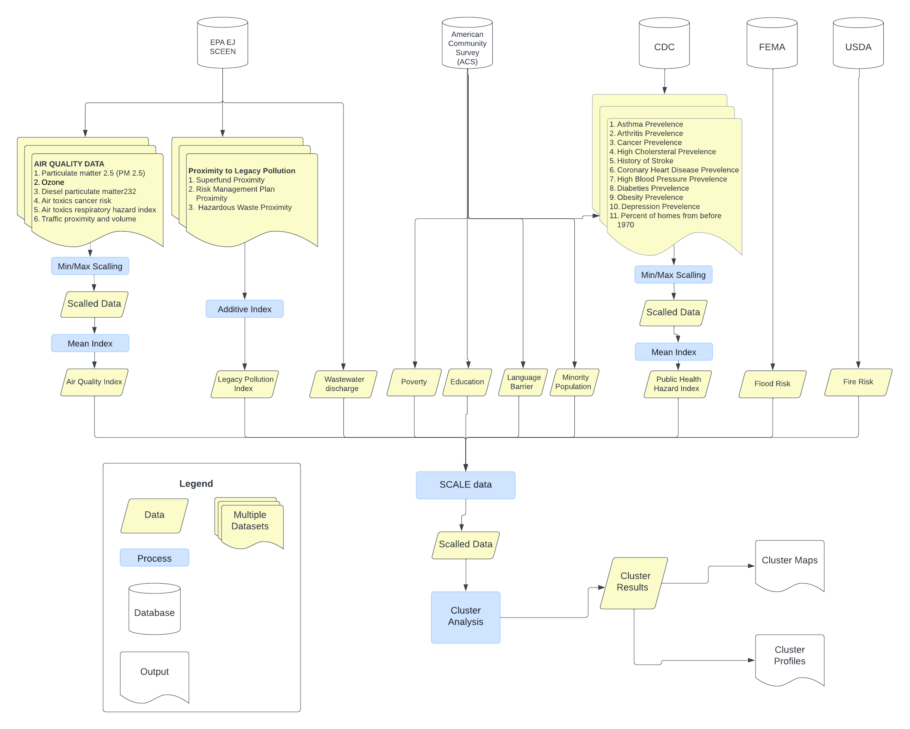

# Introduction

This project was completed as Capstone project for MUSA - 8020 Capstone Project/Advanced Topics In GIS. The project aims to explore how cluster analysis techniques, specifically k-means cluster analysis can be used to map and identify environmental justice areas, and group together areas that face similar vulnerabilities and risks.

# Existing Environmental Justice Mapping Initiatives

Over the past 10 years, there has been an increased focus on environmental justice in the United States. The Environmental Justice movement emerged because poor and/or marginalized communities have tended to harmed by hazardous waste, resource extraction, and other negative land uses from which the marginalized communities do not benefit. In recent years, the federal and state government has acknowledged that health and environmental burdens have tended to have a larger impact on marginalized communities and are putting in place programs to help environmentally burdened, marginalized communities. For example, the EPA has set up an Office of Environmental Justice and External Civil Rights (OEJECR) to coordinate efforts to integrate environmental justice into all policies, programs, and activities^[Environmental Protection Agency, Learn About Environmental Justice, https://www.epa.gov/environmentaljustice/learn-about-environmental-justice]. Additionally, the Biden Administration launched the Justice 40 initiative in 2022, this initiative sets a goal that 40% of federal climate, clean energy, affordable and sustainable housing projects fund projects go towards marginalized communities that have been overburdened by pollution^[The White House, Justice40, A whole of Government initiative, https://www.whitehouse.gov/environmentaljustice/justice40]. At the state level, many states are also requesting that grant requests for state funding consider environmental justice as part of the request. For example, the Pennsylvania Department of Environmental Protection (DEP) notes that many state grant project require communities to consider environmental justice as part of their grant proposal^[PA Department of Environmental Protection, Funding Opportunities, https://www.dep.pa.gov/PublicParticipation/OfficeofEnvironmentalJustice/Funding/Pages/default.aspx]. 

The growing interest in environmental justice, and targeted funding for environmental justice initiatives has result in a growing number of environmental justice related mapping initiatives. Environmental Justice Mapping, sometimes also refereed to as burdened community mapping seeks to identify areas with a high environmental burden that also contain poor and marginalized communities. Environmental Justice mapping aims to help decision makers identify areas eligible for funding through programs like Justice40 that are designed to target marginalized and environmental burdened communities. Existing Environmental Justice Mapping has primarily occured at the state and federal level. A study by University of Indiana identified 17 state level environmental justice mapping tools^[David Konisky, Daniel Gonzalex, Kelly Leatherman. 2021. Mapping for Environmental Justice: An Analysis of State Level Tools, Environmental Resilience Institute, Indian University.]. These tools vary in complexity but typically use a mix of socio-economic and demographic data like race, income, and education data, some of the tools also incorporate environmental data through the use of data on air quality and proximity to legacy pollution sites. Some state level tools just present the raw data, while other go a step further and built environmental justice index. The first state to develop an environmental justice index was California - the California index was first released in 2013 and since been updated multiple four times^[California Office of Environmental Health Hazard Assessment. 2013 CaleEnviroScreen 1.0. https://oehha.ca.gov/calenviroscreen/report-general-info/calenviroscreen-10]. Many other states including Pennsylvania and Michigan have developed similar indexes based on the methodology used in California. In Pennsylvania, the EJ index is called PennEnviroScreen and is based on thirty different indicators which are shown in the table below. The variables are divided into four different components and separate indexes are calculated for each component. The components are then merged together into a single index. The variables on the pollution burden side tend to be environmental variables, while the population characteristic variables refer to public health, demographic, and socioeconomic characteristics of the population.


```r
Environmental_Exposure_Component <- c('Ozone Levels','Diesel Particulate Matter','Toxic Air Emissions','Toxic Water Emissions','Pesticide Usage','Traffic Density','Compressor Stations','Children Lead Risk','')

Environmental_Effects_Component <- c('Fracking Wells','Conventional Oil and Gas wells','Railroad length','Land remediation sites','Hazardous Waste sites','Coal Mines','Impaired Water sites','Abandoned Mines','Municipal waste sites ')

Sensitive_pop_component = c('Asthma Prevalence','Population without health insurance','Cancer prevalence','Disabled Population','Coronary Heart Disease Prevalence','','','','')

Socioeconomic_component = c('High school degree','Population that does not speak English','Poverty Rate','Housing Burdened population','People of Color population','Unemployed population','Population over 65','Population under 5','')

cbind(Environmental_Exposure_Component,Environmental_Effects_Component,Sensitive_pop_component,Socioeconomic_component) %>%
  kbl(col.names = c('Environmental Exposure Component','Environmental Effects Component','Sensitive Pop Component','Socioeconomic Component')) %>%
  kable_minimal() %>%
  kable_styling('striped',stripe_color = "green") %>%
  add_header_above(header = c('Pollution Burden' = 2, 'Population Characteristic' = 2))
```

<table class=" lightable-minimal table table-striped" style='font-family: "Trebuchet MS", verdana, sans-serif; margin-left: auto; margin-right: auto; margin-left: auto; margin-right: auto;'>
 <thead>
<tr>
<th style="padding-bottom:0; padding-left:3px;padding-right:3px;text-align: center; " colspan="2"><div style="border-bottom: 2px solid #00000050; ">Pollution Burden</div></th>
<th style="padding-bottom:0; padding-left:3px;padding-right:3px;text-align: center; " colspan="2"><div style="border-bottom: 2px solid #00000050; ">Population Characteristic</div></th>
</tr>
  <tr>
   <th style="text-align:left;"> Environmental Exposure Component </th>
   <th style="text-align:left;"> Environmental Effects Component </th>
   <th style="text-align:left;"> Sensitive Pop Component </th>
   <th style="text-align:left;"> Socioeconomic Component </th>
  </tr>
 </thead>
<tbody>
  <tr>
   <td style="text-align:left;"> Ozone Levels </td>
   <td style="text-align:left;"> Fracking Wells </td>
   <td style="text-align:left;"> Asthma Prevalence </td>
   <td style="text-align:left;"> High school degree </td>
  </tr>
  <tr>
   <td style="text-align:left;"> Diesel Particulate Matter </td>
   <td style="text-align:left;"> Conventional Oil and Gas wells </td>
   <td style="text-align:left;"> Population without health insurance </td>
   <td style="text-align:left;"> Population that does not speak English </td>
  </tr>
  <tr>
   <td style="text-align:left;"> Toxic Air Emissions </td>
   <td style="text-align:left;"> Railroad length </td>
   <td style="text-align:left;"> Cancer prevalence </td>
   <td style="text-align:left;"> Poverty Rate </td>
  </tr>
  <tr>
   <td style="text-align:left;"> Toxic Water Emissions </td>
   <td style="text-align:left;"> Land remediation sites </td>
   <td style="text-align:left;"> Disabled Population </td>
   <td style="text-align:left;"> Housing Burdened population </td>
  </tr>
  <tr>
   <td style="text-align:left;"> Pesticide Usage </td>
   <td style="text-align:left;"> Hazardous Waste sites </td>
   <td style="text-align:left;"> Coronary Heart Disease Prevalence </td>
   <td style="text-align:left;"> People of Color population </td>
  </tr>
  <tr>
   <td style="text-align:left;"> Traffic Density </td>
   <td style="text-align:left;"> Coal Mines </td>
   <td style="text-align:left;">  </td>
   <td style="text-align:left;"> Unemployed population </td>
  </tr>
  <tr>
   <td style="text-align:left;"> Compressor Stations </td>
   <td style="text-align:left;"> Impaired Water sites </td>
   <td style="text-align:left;">  </td>
   <td style="text-align:left;"> Population over 65 </td>
  </tr>
  <tr>
   <td style="text-align:left;"> Children Lead Risk </td>
   <td style="text-align:left;"> Abandoned Mines </td>
   <td style="text-align:left;">  </td>
   <td style="text-align:left;"> Population under 5 </td>
  </tr>
  <tr>
   <td style="text-align:left;">  </td>
   <td style="text-align:left;"> Municipal waste sites </td>
   <td style="text-align:left;">  </td>
   <td style="text-align:left;">  </td>
  </tr>
</tbody>
</table>

At the federal level, multiple agencies have also produced Environmental Justice mapping tools. The Agency of Toxic Substances and Disease Registry (ASTDR), which is overseen by the Center for Disease Control (CDC) has created an index called the Environmental Justice Index (EJI). The EJI uses a similar method to the Pennsylvania EJ Index discussed above, but relies only on federally available datasets including data from the U.S Census Bureau, The U.S Environmental Protection Agency, and the Center for Disease Control (CDC). The index includes 36 variables which are divided into three components. The three components are the Health Vulnerability Module, The Environmental Burden Module, and the Health Vulnerability Module. 

Another example of a federal tool is the Climate and Economic Justice Screening Tool, which is frequently called CJEST. CJEST was developed by the Council on Environmental Quality (CEQ), under an executive order from the Biden Administration and is designed to help identify disadvantages communities that can benefit from Justice40 funding. Like the EJI, the CJEST is also based on data from multiple different federal datasets. However, unlike the other products discussed, CJEST does not use an index approach. Instead it considers environmentally burdened communities to include any communities where any indicator included in CJEST is at or above the 90th percentile - the census tract must also be at or above the 65th percentile for low income. The CJEST product has received some criticism for not explicitly including race in the tool[Drew Costley. Exclusion of race in federal climtae justice screening tool could worsen disparities, analysis says. 2023 Associated Press. https://apnews.com/article/environment-climate-pollution-biden-justice40-air-633392b2f4f50bbaaff8880746783966]. It has also been criticized for oversimplifying complex issues, and for failing to adequately identify and flag areas with compounding burdens[Bob Dean and Paul Esling. CEJST is a simple map, with big implications – and attention to cumulative burdens matters. 2023. Center for Neighborhood Technology. https://cnt.org/blog/cejst-is-a-simple-map-with-big-implications-and-attention-to-cumulative-burdens-matters]. 

# Limitations of Existing Tool

The current approaches for environmental justice and burdened community mapping have some limitations. Firstly, both the index approach and the threshold approach used in CJEST make it challenging for decision makers to understand what is leading to an area being classified as an environmental justice area. Understanding this requires exploring the raw data, which decision makers may not allways have the time and/or skills to do this work. Additionally, all the tools discussed here have been developed at the state or national level and do not provide information that can be used to support regional planning across state boundaries. 

# Research Questions

My research focuses on two main questions. 

1) First I aim to explore how cluster analysis techniques, specifically k-means cluster analysis can be used for environmental justice mapping. Cluster analysis identifying groups of data that share similar characteristics. In my use case, I aim to identify census tracts that share similar health and socio-economic vulnerabilities and exposure to environmental hazards. The results of the cluster analysis should also be able to help identify clusters that experience similar compounding hazards and vulnerabilities.

2) I am aim to carryout my analysis at a regional scale, and will use a study areas that transcends states boundaries. The results of the cluster analysis, should allow decision makers to make comparisons across a larger region and support regional decision making which. This type of decision making is often challenging when using the existing tools.  


# Study Area

My study area is the Delaware River Basin, specifically the sections of the Basin located in Delaware, New Jersey, and Pennsylvania. The study area is shown in orange in the figure below.  I choose to examine a natural boundary like a watershed because environmental contamination does not respect political boundaries. Additionally, environmental planners are often interested in being able to analyze and make comparisons across a natural boundary such as a watershed. A cross-state analysis will also allow my results to be more useful for regional level planning and regional decision making. 


```r
states1 <- states() %>%
  filter(STUSPS %in% c('PA','NJ','DE','NY','MD')) %>% st_transform(26918)

states2 <- states1 %>% filter(STUSPS %in% c('PA','NJ','DE'))

de_river_basin <- st_read('https://services8.arcgis.com/5Wj4rmM3lycu9Zo6/arcgis/rest/services/DRB_SAs/FeatureServer/0/query?f=geojson&where=1=1') %>%
  st_transform(26918)


study_area <- st_intersection(de_river_basin,st_union(states2))
```


```r
ggplot()+
  geom_sf(data=study_area,color='transparent',fill='orange')+
  geom_sf(data=de_river_basin,color='lightblue', fill='transparent',linewidth=1.5)+
  geom_sf(data=states2,color='black',fill='transparent')+
  theme_void()
```

<!-- -->

# Datasets

The table below shows the datasets which are included in my cluster analysis. In total 10 different variables will be included in the cluster analysis. I choose to rely on federal datasets in order to allow my research to be replicable in another geography. 


```r
Variable = c('Air Pollution Index','Proximity to Legacy Polluion','Water Quality','Flood Risk','Wildfire Risk','Minority Population','Poverty','Education','Language Barrier','Public Health Hazard Index')

Source = c('EPA EJ Screen','EPA EJ Screen','EPA EJ Screen','FEMA','USDA','American Community Survey, 2022','American Community Survey, 2022','American Community Survey, 2022','American Community Survey, 2022','CDC PLACES DATASET')

Notes = c('Index calculated based on Particulate Matter in Air, ozone, Disel Particulate Matter in Air, Cancer Risk from inflation of Air Toxics, and Tradffic Volume and Proximity','Calculated based on Proximity to superfund sites, proximity to risk management facilities, and Proxmity to hazardous waste facilities','Modeled toxic concentrations at stream segments within 500 meters','Percent of Tracts located in the FEMA Flood Plain','Wildfire Likelihood (Chance of Fire in Any Year)','% of population that is not white','% of population below poverty line','% of population without post-secondary degree','% of Population That Does not speak English','Index Calcuated based on % of 18+ population with the following chronic conditions: arthritis, cancer, high cholestrol, asthma, history of stroke, depression, Coronary Hear Diseas, Diabetes and Obesity')

cbind(Variable,Source,Notes) %>%
  kbl() %>%
  kable_minimal() %>%
  kable_styling('striped',stripe_color = "green")
```

<table class=" lightable-minimal table table-striped" style='font-family: "Trebuchet MS", verdana, sans-serif; margin-left: auto; margin-right: auto; margin-left: auto; margin-right: auto;'>
 <thead>
  <tr>
   <th style="text-align:left;"> Variable </th>
   <th style="text-align:left;"> Source </th>
   <th style="text-align:left;"> Notes </th>
  </tr>
 </thead>
<tbody>
  <tr>
   <td style="text-align:left;"> Air Pollution Index </td>
   <td style="text-align:left;"> EPA EJ Screen </td>
   <td style="text-align:left;"> Index calculated based on Particulate Matter in Air, ozone, Disel Particulate Matter in Air, Cancer Risk from inflation of Air Toxics, and Tradffic Volume and Proximity </td>
  </tr>
  <tr>
   <td style="text-align:left;"> Proximity to Legacy Polluion </td>
   <td style="text-align:left;"> EPA EJ Screen </td>
   <td style="text-align:left;"> Calculated based on Proximity to superfund sites, proximity to risk management facilities, and Proxmity to hazardous waste facilities </td>
  </tr>
  <tr>
   <td style="text-align:left;"> Water Quality </td>
   <td style="text-align:left;"> EPA EJ Screen </td>
   <td style="text-align:left;"> Modeled toxic concentrations at stream segments within 500 meters </td>
  </tr>
  <tr>
   <td style="text-align:left;"> Flood Risk </td>
   <td style="text-align:left;"> FEMA </td>
   <td style="text-align:left;"> Percent of Tracts located in the FEMA Flood Plain </td>
  </tr>
  <tr>
   <td style="text-align:left;"> Wildfire Risk </td>
   <td style="text-align:left;"> USDA </td>
   <td style="text-align:left;"> Wildfire Likelihood (Chance of Fire in Any Year) </td>
  </tr>
  <tr>
   <td style="text-align:left;"> Minority Population </td>
   <td style="text-align:left;"> American Community Survey, 2022 </td>
   <td style="text-align:left;"> % of population that is not white </td>
  </tr>
  <tr>
   <td style="text-align:left;"> Poverty </td>
   <td style="text-align:left;"> American Community Survey, 2022 </td>
   <td style="text-align:left;"> % of population below poverty line </td>
  </tr>
  <tr>
   <td style="text-align:left;"> Education </td>
   <td style="text-align:left;"> American Community Survey, 2022 </td>
   <td style="text-align:left;"> % of population without post-secondary degree </td>
  </tr>
  <tr>
   <td style="text-align:left;"> Language Barrier </td>
   <td style="text-align:left;"> American Community Survey, 2022 </td>
   <td style="text-align:left;"> % of Population That Does not speak English </td>
  </tr>
  <tr>
   <td style="text-align:left;"> Public Health Hazard Index </td>
   <td style="text-align:left;"> CDC PLACES DATASET </td>
   <td style="text-align:left;"> Index Calcuated based on % of 18+ population with the following chronic conditions: arthritis, cancer, high cholestrol, asthma, history of stroke, depression, Coronary Hear Diseas, Diabetes and Obesity </td>
  </tr>
</tbody>
</table>


# Methodology

The flow chart below shows my methods for carrying out this analysis. The schematic is intended to be a high level overview of the methods used. Additional annotations will be provided throughout the code to provide additional details on each step of the process. 



# Data Wrangling

## Census Data


## EPA EJ Screen Data


```r
url <- httr2::url_parse("https://services.arcgis.com/cJ9YHowT8TU7DUyn/ArcGIS/rest/services/EJScreen_StatePctiles_with_AS_CNMI_GU_VI_Tracts/FeatureServer/0/query")

url$query <- list(
  where = "ST_ABBREV IN ('PA','DE','NJ')",
  outFields = "ID,STATE_NAME,CNTY_NAME,PM25,OZONE,DSLPM,CANCER,RESP,PTRAF,PNPL,PTSDF,UST,PWDIS",
  returnGeometry = "false",
  f = "json"
)

final_url <- httr2::url_build(url)

epa_data <- sf::st_read(final_url) %>% st_drop_geometry() %>% rename(GEOID = ID) %>% rename (AIR_CANCER = CANCER)
```

## CDC Public Health Data


```r
places_pa <- read.socrata('https://data.cdc.gov/resource/cwsq-ngmh.csv?stateabbr=PA')
places_de <- read.socrata('https://data.cdc.gov/resource/cwsq-ngmh.csv?stateabbr=DE')
places_nj <- read.socrata('https://data.cdc.gov/resource/cwsq-ngmh.csv?stateabbr=NJ')

home_vars = c('B25034_001','B25034_011','B25034_010','B25034_009')

home_data <- rbind(process_acs('DE','tract',home_vars,2019),process_acs('PA','tract',home_vars,2019),process_acs('NJ','tract',home_vars,2019)) %>%
  st_transform(26918) %>%
  mutate (pct_old_homes = (B25034_011E + B25034_010E + B25034_009E) / B25034_001E * 100) %>%
  select(pct_old_homes, GEOID) %>%
  st_drop_geometry()

all_places <- rbind(places_pa,places_de,places_nj) %>%
  filter(category == 'Health Outcomes') %>%
  pivot_wider(id_cols='locationname',names_from='measureid',values_from='data_value') %>%
  rename(GEOID = locationname) %>%
  mutate(GEOID = as.character(GEOID)) %>%
  dplyr::select(GEOID,ARTHRITIS,CANCER,CASTHMA,HIGHCHOL,DEPRESSION,STROKE,OBESITY,DIABETES,CHD) %>%
  left_join(.,home_data,by='GEOID')

tracts2010 <- rbind(tracts(state='PA',year=2019),tracts(state='DE',year=2019),tracts(state='NJ',year=2019)) %>% st_transform(26918)

cpc_basin <- tracts2010 %>%
  st_centroid() %>%
  st_intersection(., study_area) %>%
  st_drop_geometry() %>%
  left_join(.,tracts2010 %>% dplyr::select (GEOID,geometry),by='GEOID') %>%
  st_as_sf() %>%
  select('STATEFP','GEOID','geometry') %>%
  left_join(.,all_places,by='GEOID') %>%
  drop_na()
```

# Exploratory Data Analysis

## CDC Public Health Data


```r
cpc_basin %>% 
  st_drop_geometry() %>%
  dplyr::select(ARTHRITIS,CANCER,CASTHMA,HIGHCHOL,DEPRESSION,STROKE,OBESITY,DIABETES,CHD,pct_old_homes) %>%
  drop_na() %>%
  cor() %>%
  corrplot(addCoef.col = "black", number.cex = 0.7)
```

<!-- -->

```r
ggsave('outputs/cdc_plot.png')
```


```r
cpc_no_geom <- cpc_basin %>%
  st_drop_geometry() %>%
  dplyr::select(ARTHRITIS,CANCER,CASTHMA,HIGHCHOL,DEPRESSION,STROKE,OBESITY,DIABETES,CHD,pct_old_homes)

process <- preProcess(cpc_no_geom, method=c("range"))

health_index <- predict(process, cpc_no_geom) %>% rowMeans() 

min <- min(health_index)

max <- max(health_index)

health_hazard_index <- (health_index - min) / (max - min) 
                      
cpc_basin <- cbind(cpc_basin,health_hazard_index)
```


```r
#Retain Four Components

pca <- prcomp(cpc_no_geom,center=TRUE,scale=TRUE)

summary(pca)
```

```
## Importance of components:
##                           PC1    PC2     PC3     PC4     PC5     PC6     PC7
## Standard deviation     2.0964 1.7893 0.95162 0.84951 0.63132 0.46126 0.30972
## Proportion of Variance 0.4395 0.3202 0.09056 0.07217 0.03986 0.02128 0.00959
## Cumulative Proportion  0.4395 0.7596 0.85019 0.92235 0.96221 0.98349 0.99308
##                            PC8     PC9    PC10
## Standard deviation     0.19939 0.13174 0.10996
## Proportion of Variance 0.00398 0.00174 0.00121
## Cumulative Proportion  0.99706 0.99879 1.00000
```

```r
pca_index2<- pca$x[,1:5] %>% as_data_frame() %>%
  mutate(PC1 = PC1 * -1,
         PC2 = PC2 * -1,
         PC3 = PC3 * -1) %>% 
  rowSums()

min <- min(pca_index2)

max <- max(pca_index2)

pca_index2 <- (pca_index2 - min) / (max - min) 

cpc_basin <-cbind(cpc_basin,pca_index2)
```


```r
boundings <- st_bbox(basin_tracts)
xmin = boundings[1]
ymin = boundings[2]
xmax = boundings[3]
ymax = boundings[4]

states_map <- states1 %>% erase_water(area_threshold=0.99)

p1 <- ggplot()+
  geom_sf(data=states_map,fill='gray95',color='transparent')+
  geom_sf(data=cpc_basin,aes(fill= health_hazard_index),linewidth=0.2,color='transparent')+
  scale_fill_distiller(palette = 'RdYlGn')+
  geom_sf(data=states1,fill='transparent',color='gray10',linewidth=0.5)+
  xlim(xmin,xmax)+
  ylim(ymin,ymax)+
  ggtitle("Health Hazard Averaging Index")+
  theme_void()+
  theme(panel.background = element_rect(fill = '#d3f6ff',color='transparent'))

p2 <- ggplot()+
  geom_sf(data=states_map,fill='gray95',color='transparent')+
  geom_sf(data=cpc_basin,aes(fill=pca_index2),linewidth=0.2,color='transparent')+
  scale_fill_distiller(palette = 'RdYlGn')+
  geom_sf(data=states1,fill='transparent',color='gray10',linewidth=0.5)+
  xlim(xmin,xmax)+
  ylim(ymin,ymax)+
  theme_void()+
  ggtitle("Health Hazard PCA Index")+
  theme(panel.background = element_rect(fill = '#d3f6ff',color='transparent'))

grid.arrange(p1,p2,nrow=1)
```

<!-- -->

```r
ggsave('outputs/health.png')
```

## Join Together CPC, EPA, and Census Data


```r
basin_tracts_2 <- left_join(basin_tracts,epa_data,by='GEOID') %>% #Join tracts to EPA data
  filter(total_pop > 0) %>% #Remove tracts with no population
  mutate(pct_non_english = ifelse(is.nan(pct_non_english),NA,pct_non_english), #Turn nan to NA where denominator was zero.
         pct_poverty = ifelse(is.nan(pct_poverty),NA,pct_poverty)) #Turn nan to NA where denominator was zero.

boundary_changes <- read.csv('Data/Boundary_Changes.csv') 

basin_tracts_2 <- boundary_changes %>%
  select(GEOID_TRACT_20,AREALAND_TRACT_20,GEOID_TRACT_10,AREALAND_TRACT_10,AREALAND_PART) %>%
  mutate(pct20 = round(AREALAND_PART / AREALAND_TRACT_20,2),
         GEOID_TRACT_10 = as.character(GEOID_TRACT_10),
         GEOID_TRACT_20 = as.character(GEOID_TRACT_20)) %>% 
  right_join(.,cpc_basin %>% select(health_hazard_index,pca_index2,GEOID),by=join_by(GEOID_TRACT_10==GEOID)) %>%
  mutate(weighted_index = round(pct20 * health_hazard_index,2),
         pca_index = round(pct20 * pca_index2,2)) %>%
  st_drop_geometry() %>%
  group_by(GEOID_TRACT_20) %>% 
  summarise(health_hazard_index = sum(weighted_index),
            pca_health_index = sum(pca_index)) %>%
  rename(GEOID = GEOID_TRACT_20) %>%
  left_join(basin_tracts_2,.,by='GEOID')

basin_tracts_2_4269 <- basin_tracts_2 %>% st_transform(4269)
```

## Pollution Data Analysis


```r
basin_tracts_2 %>% 
  st_drop_geometry() %>%
  dplyr::select(PM25,OZONE,DSLPM,AIR_CANCER,RESP,PTRAF) %>%
  correlate() %>% 
  autoplot() +
  geom_text(aes(label = round(r,digits=2)), size = 3.5, order = "hclust", type = "upper", tl.cex = 3)
```

<!-- -->

```r
ggsave('outputs/corplot1.png')
```


```r
basin_air_no_geom <- basin_tracts_2 %>%
  st_drop_geometry() %>%
  dplyr::select(PM25,OZONE,DSLPM,AIR_CANCER,RESP,PTRAF)

process <- preProcess(basin_air_no_geom, method=c("range"))

air_index <- predict(process, basin_air_no_geom) %>% rowMeans() 

basin_tracts_2 <- cbind(basin_tracts_2,air_index)
```


```r
create_map1 <- function(col,t){
  ggplot()+  
    geom_sf(data=states_map,fill='gray95',color='transparent')+
    geom_sf(data=basin_tracts_2,aes(fill={{col}}),color='transparent')+
    scale_fill_viridis_c(option='rocket',direction=-1)+
    geom_sf(data=states1,fill='transparent',color='gray20',linewidth=0.5)+
    xlim(xmin,xmax)+
    ylim(ymin,ymax)+
    theme_void()+
    theme(panel.background = element_rect(fill = '#d3f6ff',color='transparent'))+
    labs(title = t)
}

m1 <- create_map1(PM25,'Particulate Matter')
m2 <- create_map1(OZONE,'Ozone')
m3 <- create_map1(DSLPM,'Disel Particulate Matter')
m4 <- create_map1(AIR_CANCER,'Air toxics cancer risk')
m5 <- create_map1(RESP,'Respiratory hazard index')
m6 <- create_map1(PTRAF,'Traffic Proximity and Volume')

grid.arrange(nrow=2,m1,m2,m3,m4,m5,m6)
```

<!-- -->

```r
g <- arrangeGrob(nrow=2,m1,m2,m3,m4,m5,m6) #generates g

ggsave('outputs/air.png',g)
```


```r
create_map1(air_index,'Air Index')
```

<!-- -->

```r
ggsave('outputs/air_index.png',width=3.1,height=5)
```

## Census Analysis


```r
create_map2 <- function(col,t){
  ggplot()+  
    geom_sf(data=states_map,fill='gray95',color='transparent')+
    geom_sf(data=basin_tracts_2,aes(fill={{col}}),color='transparent')+
    scale_fill_viridis_c(option='viridis',direction=-1,name='Percent')+
    geom_sf(data=states1,fill='transparent',color='gray20',linewidth=0.5)+
    xlim(xmin,xmax)+
    ylim(ymin,ymax)+
    theme_void()+
    theme(panel.background = element_rect(fill = '#d3f6ff',color='transparent'))+
    labs(title = t)
}


m1 <- create_map2(pct_minority,'Minority Pop.')
m2 <- create_map2(pct_non_english,'Language Barrier')
m3 <- create_map2(pct_poverty,'Poverty')
m4 <- create_map2(pct_no_university,'No University Degree')


grid.arrange(nrow=1,m1,m2,m3,m4)
```

<!-- -->

```r
g <- arrangeGrob(nrow=1,m1,m2,m3,m4) #generates g

ggsave('outputs/socio_demographics.png',g)
```

# Hazard Data

## Flood Risk


```r
PA_flood <- st_read('Data/PA_Flood_Hazard_Zone.shp') %>%
  .[st_intersects(.,basin_tracts_2_4269) %>% lengths > 0, ]

NJ_flood <- st_read('Data/NJ_Flood_Hazard_Zone.shp')  %>%
  .[st_intersects(.,basin_tracts_2_4269) %>% lengths > 0, ]

DE_flood <- st_read('Data/DE_Flood_Hazard_Zone.shp')  %>%
  .[st_intersects(.,basin_tracts_2_4269) %>% lengths > 0, ]
```


```r
basin_tracts_3 <- basin_tracts_2 %>% erase_water()

flood_study_area <- rbind(PA_flood,DE_flood,NJ_flood) %>% 
  st_transform(26918) %>%
  st_union(.) %>%
  st_cast(.,"POLYGON") %>% st_as_sf() %>% 
  rename(geometry = x)

tracts_flood <- st_intersection(basin_tracts_3,flood_study_area) %>%
  mutate(area = st_area(.)) %>%
  st_drop_geometry() %>%
  group_by(GEOID) %>% summarise(flood_area = sum(area)) %>%
  mutate(flood_area = as.numeric(flood_area) / 1000000)

basin_tracts_3 <- basin_tracts_2 %>% erase_water()

basin_tracts_4 <- basin_tracts_3 %>%
  left_join(.,tracts_flood,by='GEOID') %>%
  mutate(flood_area = ifelse(is.na(flood_area),0,flood_area),
         area = (as.numeric(st_area(.)) / 1000000),
         flood_pct = flood_area / area * 100) %>%
  st_drop_geometry() %>%
  dplyr::select(GEOID,flood_pct) %>%
  right_join(.,basin_tracts_2,by='GEOID') %>%
  st_as_sf()
```


```r
ggplot()+
  geom_sf(data=states_map,fill='gray95',color='transparent')+
  geom_sf(data=basin_tracts_4,aes(fill=flood_pct),color='transparent')+
  scale_fill_viridis_c(option='mako',direction=-1,name='Pct. of Tract in Flood Plain')+
  geom_sf(data=states1,fill='transparent',color='gray20',linewidth=0.5)+
  xlim(xmin,xmax)+
  ylim(ymin,ymax)+
  theme_void()+
  theme(legend.position="bottom")+
  theme(panel.background = element_rect(fill = '#d3f6ff',color='transparent'))
```

<!-- -->

```r
ggsave('outputs/flood.png')
```

## Fire Risk


```r
# Load raster data for different states
raster_pa <- rast("Data/Fire/BP_PA.tif")
raster_de <- rast("Data/Fire/BP_DE.tif")
raster_nj <- rast("Data/Fire/BP_NJ.tif")

# Merge raster data into a single raster layer
merged_raster <- terra::mosaic(raster_pa, raster_de, raster_nj)

merged_raster <- project(merged_raster,"epsg:26918")

zone_values <- terra::extract(merged_raster, basin_tracts_4, method="simple", fun = mean, na.rm = TRUE)

basin_tracts_4 <- basin_tracts_4 %>%
  mutate(fire = zone_values$BP_PA * 100) %>%
  drop_na()
```


```r
ggplot()+
  geom_sf(data=states_map,fill='gray95',color='transparent')+
  geom_sf(data=basin_tracts_4,aes(fill=fire),linewidth=0.2,color='transparent')+
  scale_fill_viridis_c(option='inferno',direction=-1,name='% Likelihood of a WildFire')+
  geom_sf(data=states1,fill='transparent',color='gray10',linewidth=0.5)+
  xlim(xmin,xmax)+
  ylim(ymin,ymax)+
  theme_void()+
  theme(legend.position="bottom")+
  theme(panel.background = element_rect(fill = '#d3f6ff',color='transparent'))
```

<!-- -->

```r
ggsave('outputs/wildfire.png')
```


```r
basin_tracts_final <- basin_tracts_4 %>%
  select(flood_pct, pct_minority, pct_non_english, pct_poverty, pct_no_university, air_index, PNPL, PTSDF, UST, PWDIS,health_hazard_index,fire) %>%
  mutate(waste_proximity = PNPL + PTSDF + UST,
         PWDIS = percent_rank(PWDIS)) %>%
  rename(Wastewater = PWDIS) %>%
  select(-PNPL, -PTSDF, -UST) %>%
  st_drop_geometry() %>%
  drop_na()

process <- preProcess(basin_tracts_final, method=c("range"))

basin_tracts_final_scalled <- predict(process, basin_tracts_final)
```

# Cluster Analysis


```r
wss <- c()
for (i in seq(from=2,to=25,by=1)) wss[i] <- sum(kmeans(basin_tracts_final_scalled, centers=i, nstart=25)$withinss)

bind <- cbind(clusters = seq(from=1,to=25,by=1),wss) %>%
  as.data.frame() %>%
  dplyr::filter(clusters > 1)

ggplot(data=bind)+
  geom_line(aes(x=clusters,y=wss),linewidth=0.5,color='gray60')+
  geom_point(aes(x=clusters,y=wss),size=1.5,color='gray60')+
  geom_point(data = bind %>% filter(clusters == 9),aes(x=clusters,y=wss,label=clusters),size=2.5,color='red')+
  geom_text(data = bind %>% filter(clusters != 9),aes(x=clusters + 0.2,y=wss + 10,label=clusters),size=3,color='gray60')+
  geom_text(data = bind %>% filter(clusters == 9),aes(x=clusters + 0.3,y=wss + 15,label=clusters),size=5,color='red')+
  scale_x_continuous(breaks=seq(from=2,to=25,by=1))+
  labs(x='Number of Clusters',y='Within groups sum of squares')+
  theme_bw()+
  theme(panel.border = element_blank(),panel.grid.major.x= element_blank(),panel.grid.minor = element_blank(),axis.text.x = element_blank(),axis.ticks.x = element_blank())
```

<!-- -->

MAKE INTERACTIVE MAP HERE


```r
color = c('#8dd3c7','#ffffb3','#bebada','#fb8072','#80b1d3','#fdb462','#b3de69','#fccde5','#d9d9d9')

clusters <- kmeans(basin_tracts_final_scalled, centers=9, nstart=25)$cluster

results <- cbind(basin_tracts_4 %>% select('geometry'),basin_tracts_final_scalled,clusters)

ggplot()+
  geom_sf(data=states_map,fill='gray95',color='transparent')+
  geom_sf(data=results,aes(fill=as.factor(clusters)),color='transparent')+
  scale_fill_manual(values=color,name='cluster')+
  geom_sf(data=states1,fill='transparent',color='gray10',linewidth=0.5)+
  xlim(xmin,xmax)+
  ylim(ymin,ymax)+
  theme_void()+
  theme(panel.background = element_rect(fill = '#d3f6ff',color='transparent'))
```

<!-- -->

## Cluster Interpretation


```r
cluster_medians <- results %>% 
  group_by(clusters) %>% st_drop_geometry() %>% summarise_all(median) %>% mutate_if(is.numeric, round, digits=2) %>% mutate(stat='Median')

cluster_means <- results %>% 
  group_by(clusters) %>% st_drop_geometry() %>% summarise_all(mean) %>% mutate_if(is.numeric, round, digits=2) %>% mutate(stat='Mean')

cluster_means_medians <- rbind(cluster_means,cluster_medians) %>%
  pivot_longer(cols=c(-clusters,-stat),names_to='variable',values_to='value')

ggplot(data=cluster_means_medians)+
  geom_bar(aes(x=as.factor(clusters),y=value,fill=stat),position="dodge", stat="identity")+
  facet_wrap(~variable,nrow=2,scales='free')+
  scale_x_discrete(guide = guide_axis(angle = 90),name='cluster')+
  scale_y_continuous(limits=c(0,1),name='Min/Max Scalled Value')+
  scale_fill_manual(name='Statistic',values=c('#66c2a5','#fc8d62'))+
  theme_tufte()+
  theme(axis.line=element_line())
```

<!-- -->


```r
quantiles <- sapply(basin_tracts_final_scalled, function(x) quantile(x, na.rm = TRUE,probs = c(0.25,0.5,0.75)))

cluster_medians %>%
  select(-stat) %>%
  kbl(col.names=c('Cluster','Flood Risk','Minority Population','Non English Speaking','Poverty','Limited Education','Air Quality Index','Wastewater','Health Hazard Index','Fire Risk','Waste Proximity')) %>%
  kable_minimal() %>%
  column_spec(2,background=ifelse(cluster_medians$flood_pct > quantiles[3,1],'red','white')) %>%
  column_spec(3,background=ifelse(cluster_medians$pct_minority > quantiles[3,2],'red','white')) %>%
  column_spec(4,background=ifelse(cluster_medians$pct_non_english > quantiles[3,3],'red','white')) %>%
  column_spec(5,background=ifelse(cluster_medians$pct_poverty > quantiles[3,4],'red','white')) %>%
  column_spec(6,background=ifelse(cluster_medians$pct_no_university > quantiles[3,5],'red','white')) %>%
  column_spec(7,background=ifelse(cluster_medians$air_index > quantiles[3,6],'red','white')) %>%
  column_spec(8,background=ifelse(cluster_medians$Wastewater > quantiles[3,7],'red','white')) %>%
  column_spec(9,background=ifelse(cluster_medians$health_hazard_index > quantiles[3,8],'red','white')) %>%
  column_spec(10,background=ifelse(cluster_medians$fire > quantiles[3,9],'red','white')) %>%
  column_spec(11,background=ifelse(cluster_medians$waste_proximity > quantiles[3,10],'red','white'))
```

<table class=" lightable-minimal" style='font-family: "Trebuchet MS", verdana, sans-serif; margin-left: auto; margin-right: auto;'>
 <thead>
  <tr>
   <th style="text-align:right;"> Cluster </th>
   <th style="text-align:right;"> Flood Risk </th>
   <th style="text-align:right;"> Minority Population </th>
   <th style="text-align:right;"> Non English Speaking </th>
   <th style="text-align:right;"> Poverty </th>
   <th style="text-align:right;"> Limited Education </th>
   <th style="text-align:right;"> Air Quality Index </th>
   <th style="text-align:right;"> Wastewater </th>
   <th style="text-align:right;"> Health Hazard Index </th>
   <th style="text-align:right;"> Fire Risk </th>
   <th style="text-align:right;"> Waste Proximity </th>
  </tr>
 </thead>
<tbody>
  <tr>
   <td style="text-align:right;"> 1 </td>
   <td style="text-align:right;background-color: white !important;"> 0.06 </td>
   <td style="text-align:right;background-color: white !important;"> 0.16 </td>
   <td style="text-align:right;background-color: white !important;"> 0.02 </td>
   <td style="text-align:right;background-color: white !important;"> 0.05 </td>
   <td style="text-align:right;background-color: white !important;"> 0.31 </td>
   <td style="text-align:right;background-color: white !important;"> 0.57 </td>
   <td style="text-align:right;background-color: white !important;"> 0.51 </td>
   <td style="text-align:right;background-color: white !important;"> 0.39 </td>
   <td style="text-align:right;background-color: white !important;"> 0.02 </td>
   <td style="text-align:right;background-color: white !important;"> 0.04 </td>
  </tr>
  <tr>
   <td style="text-align:right;"> 2 </td>
   <td style="text-align:right;background-color: red !important;"> 0.65 </td>
   <td style="text-align:right;background-color: white !important;"> 0.30 </td>
   <td style="text-align:right;background-color: white !important;"> 0.04 </td>
   <td style="text-align:right;background-color: white !important;"> 0.17 </td>
   <td style="text-align:right;background-color: white !important;"> 0.56 </td>
   <td style="text-align:right;background-color: white !important;"> 0.59 </td>
   <td style="text-align:right;background-color: white !important;"> 0.58 </td>
   <td style="text-align:right;background-color: red !important;"> 0.55 </td>
   <td style="text-align:right;background-color: white !important;"> 0.03 </td>
   <td style="text-align:right;background-color: white !important;"> 0.10 </td>
  </tr>
  <tr>
   <td style="text-align:right;"> 3 </td>
   <td style="text-align:right;background-color: white !important;"> 0.06 </td>
   <td style="text-align:right;background-color: white !important;"> 0.18 </td>
   <td style="text-align:right;background-color: white !important;"> 0.03 </td>
   <td style="text-align:right;background-color: white !important;"> 0.05 </td>
   <td style="text-align:right;background-color: white !important;"> 0.29 </td>
   <td style="text-align:right;background-color: white !important;"> 0.58 </td>
   <td style="text-align:right;background-color: white !important;"> 0.15 </td>
   <td style="text-align:right;background-color: white !important;"> 0.38 </td>
   <td style="text-align:right;background-color: white !important;"> 0.02 </td>
   <td style="text-align:right;background-color: white !important;"> 0.04 </td>
  </tr>
  <tr>
   <td style="text-align:right;"> 4 </td>
   <td style="text-align:right;background-color: white !important;"> 0.03 </td>
   <td style="text-align:right;background-color: white !important;"> 0.22 </td>
   <td style="text-align:right;background-color: white !important;"> 0.03 </td>
   <td style="text-align:right;background-color: white !important;"> 0.08 </td>
   <td style="text-align:right;background-color: white !important;"> 0.19 </td>
   <td style="text-align:right;background-color: white !important;"> 0.64 </td>
   <td style="text-align:right;background-color: red !important;"> 0.88 </td>
   <td style="text-align:right;background-color: white !important;"> 0.34 </td>
   <td style="text-align:right;background-color: white !important;"> 0.01 </td>
   <td style="text-align:right;background-color: white !important;"> 0.09 </td>
  </tr>
  <tr>
   <td style="text-align:right;"> 5 </td>
   <td style="text-align:right;background-color: white !important;"> 0.00 </td>
   <td style="text-align:right;background-color: red !important;"> 0.91 </td>
   <td style="text-align:right;background-color: white !important;"> 0.06 </td>
   <td style="text-align:right;background-color: red !important;"> 0.36 </td>
   <td style="text-align:right;background-color: red !important;"> 0.63 </td>
   <td style="text-align:right;background-color: red !important;"> 0.69 </td>
   <td style="text-align:right;background-color: red !important;"> 0.83 </td>
   <td style="text-align:right;background-color: red !important;"> 0.65 </td>
   <td style="text-align:right;background-color: white !important;"> 0.00 </td>
   <td style="text-align:right;background-color: red !important;"> 0.15 </td>
  </tr>
  <tr>
   <td style="text-align:right;"> 6 </td>
   <td style="text-align:right;background-color: white !important;"> 0.07 </td>
   <td style="text-align:right;background-color: white !important;"> 0.23 </td>
   <td style="text-align:right;background-color: white !important;"> 0.04 </td>
   <td style="text-align:right;background-color: white !important;"> 0.12 </td>
   <td style="text-align:right;background-color: white !important;"> 0.52 </td>
   <td style="text-align:right;background-color: white !important;"> 0.58 </td>
   <td style="text-align:right;background-color: red !important;"> 0.76 </td>
   <td style="text-align:right;background-color: white !important;"> 0.50 </td>
   <td style="text-align:right;background-color: white !important;"> 0.01 </td>
   <td style="text-align:right;background-color: white !important;"> 0.07 </td>
  </tr>
  <tr>
   <td style="text-align:right;"> 7 </td>
   <td style="text-align:right;background-color: white !important;"> 0.05 </td>
   <td style="text-align:right;background-color: white !important;"> 0.12 </td>
   <td style="text-align:right;background-color: white !important;"> 0.01 </td>
   <td style="text-align:right;background-color: white !important;"> 0.11 </td>
   <td style="text-align:right;background-color: white !important;"> 0.55 </td>
   <td style="text-align:right;background-color: white !important;"> 0.27 </td>
   <td style="text-align:right;background-color: white !important;"> 0.22 </td>
   <td style="text-align:right;background-color: white !important;"> 0.49 </td>
   <td style="text-align:right;background-color: white !important;"> 0.02 </td>
   <td style="text-align:right;background-color: white !important;"> 0.01 </td>
  </tr>
  <tr>
   <td style="text-align:right;"> 8 </td>
   <td style="text-align:right;background-color: white !important;"> 0.00 </td>
   <td style="text-align:right;background-color: red !important;"> 0.70 </td>
   <td style="text-align:right;background-color: red !important;"> 0.50 </td>
   <td style="text-align:right;background-color: red !important;"> 0.35 </td>
   <td style="text-align:right;background-color: red !important;"> 0.78 </td>
   <td style="text-align:right;background-color: red !important;"> 0.69 </td>
   <td style="text-align:right;background-color: white !important;"> 0.56 </td>
   <td style="text-align:right;background-color: red !important;"> 0.60 </td>
   <td style="text-align:right;background-color: white !important;"> 0.00 </td>
   <td style="text-align:right;background-color: red !important;"> 0.15 </td>
  </tr>
  <tr>
   <td style="text-align:right;"> 9 </td>
   <td style="text-align:right;background-color: white !important;"> 0.06 </td>
   <td style="text-align:right;background-color: red !important;"> 0.55 </td>
   <td style="text-align:right;background-color: red !important;"> 0.10 </td>
   <td style="text-align:right;background-color: white !important;"> 0.18 </td>
   <td style="text-align:right;background-color: white !important;"> 0.53 </td>
   <td style="text-align:right;background-color: white !important;"> 0.60 </td>
   <td style="text-align:right;background-color: white !important;"> 0.27 </td>
   <td style="text-align:right;background-color: white !important;"> 0.47 </td>
   <td style="text-align:right;background-color: white !important;"> 0.02 </td>
   <td style="text-align:right;background-color: white !important;"> 0.10 </td>
  </tr>
</tbody>
</table>


```r
t <- quantiles %>% as_data_frame() %>%
  cbind(.,stat=c('Q1','Median','Q3')) %>%
  pivot_longer(-stat,names_to='variables',values_to='value')

medians <- t %>%
  filter(stat == "Median")

q3 <- t %>%
  filter(stat == "Q3")

results_long <- results %>%
  st_drop_geometry() %>%
  pivot_longer(-clusters,names_to='variables',values_to='value')

ggplot(data=results_long)+
  geom_boxplot(aes(x=as.factor(clusters),y=value,fill=as.factor(clusters)))+
  geom_hline(data=medians,aes(yintercept=value),color='orange',linewidth=1)+
  geom_hline(data=q3,aes(yintercept=value),color='red',linewidth=1)+
  scale_fill_manual(values=color,name='Cluster')+
  scale_x_discrete(name='Cluster')+
  scale_y_continuous(name='Min/Max Scalled Value')+
  facet_wrap(~variables,nrow=2)+
  theme_bw()
```

<!-- -->

```r
ggsave('outputs/image1.png')
```


```r
cluster_mean <- function(cluster){
results %>%
  st_drop_geometry() %>%
  filter(clusters == cluster) %>%
  summarize(across(-clusters, ~ quantile(., probs = c(0.25, 0.5, 0.75)))) %>%
  mutate(clusters = cluster) %>%
  cbind(., stat=c('Q1','Median','Q3'))}

flags <- map_dfr(c(1,2,3,4,5,6,7,8,9), ~ cluster_mean(.x)) %>%
  pivot_longer(cols=c(-clusters,-stat), names_to='variables', values_to='values') %>%
  left_join(., t %>% pivot_wider(id_cols=variables, names_from=stat),by='variables') %>%
  mutate(flag = ifelse(stat == 'Median' & values > Q3, 1, NA),
         flag = ifelse(stat == 'Q1' & values > Median, 1, NA),
         flag = ifelse(stat == 'Q1' & values > Q3, 2, flag)) %>%
  group_by(variables, clusters) %>%
  summarize(flag = max(flag, na.rm = TRUE)) %>%
  mutate(flag = ifelse(as.character(flag) == '-Inf', '', as.character(flag)))


flags_wide <- flags %>%
  pivot_wider(id_cols = clusters, names_from = variables, values_from = flag)
  
flags_wide %>%
  kbl(col.names = c('Cluster','Wastewater','Air Quality','Fire Risk','Flood Risk','Public Health Hazard','Minority Population','Limited Education','Non English Speaking','Poverty','Waste Proximity'),align="c") %>%
  column_spec(2,color=ifelse(flags_wide$Wastewater == 2,'red',ifelse(flags_wide$Wastewater == 1,'red','white'))) %>%
  column_spec(3,color=ifelse(flags_wide$air_index == 2,'red',ifelse(flags_wide$air_index == 1,'red','white'))) %>%
  column_spec(4,color=ifelse(flags_wide$fire == 2,'red',ifelse(flags_wide$fire == 1,'red','white'))) %>%
  column_spec(5,color=ifelse(flags_wide$flood_pct == 2,'red',ifelse(flags_wide$flood_pct == 1,'red','white'))) %>%
  column_spec(6,color=ifelse(flags_wide$health_hazard_index == 2,'red',ifelse(flags_wide$health_hazard_index == 1,'red','white'))) %>%
  column_spec(7,color=ifelse(flags_wide$pct_minority == 2,'red',ifelse(flags_wide$pct_minority == 1,'red','white'))) %>%
  column_spec(8,color=ifelse(flags_wide$pct_no_university == 2,'red',ifelse(flags_wide$pct_no_university == 1,'red','white'))) %>%
  column_spec(9,color=ifelse(flags_wide$pct_non_english == 2,'red',ifelse(flags_wide$pct_non_english == 1,'red','white'))) %>%
  column_spec(10,color=ifelse(flags_wide$pct_poverty == 2,'red',ifelse(flags_wide$pct_poverty == 1,'red','white'))) %>%
  column_spec(11,color=ifelse(flags_wide$waste_proximity == 2,'red',ifelse(flags_wide$waste_proximity == 1,'red','white'))) %>%
  kable_styling()
```

<table class="table" style="margin-left: auto; margin-right: auto;">
 <thead>
  <tr>
   <th style="text-align:center;"> Cluster </th>
   <th style="text-align:center;"> Wastewater </th>
   <th style="text-align:center;"> Air Quality </th>
   <th style="text-align:center;"> Fire Risk </th>
   <th style="text-align:center;"> Flood Risk </th>
   <th style="text-align:center;"> Public Health Hazard </th>
   <th style="text-align:center;"> Minority Population </th>
   <th style="text-align:center;"> Limited Education </th>
   <th style="text-align:center;"> Non English Speaking </th>
   <th style="text-align:center;"> Poverty </th>
   <th style="text-align:center;"> Waste Proximity </th>
  </tr>
 </thead>
<tbody>
  <tr>
   <td style="text-align:center;"> 1 </td>
   <td style="text-align:center;color: white !important;">  </td>
   <td style="text-align:center;color: white !important;">  </td>
   <td style="text-align:center;color: white !important;">  </td>
   <td style="text-align:center;color: white !important;">  </td>
   <td style="text-align:center;color: white !important;">  </td>
   <td style="text-align:center;color: white !important;">  </td>
   <td style="text-align:center;color: white !important;">  </td>
   <td style="text-align:center;color: white !important;">  </td>
   <td style="text-align:center;color: white !important;">  </td>
   <td style="text-align:center;color: white !important;">  </td>
  </tr>
  <tr>
   <td style="text-align:center;"> 2 </td>
   <td style="text-align:center;color: white !important;">  </td>
   <td style="text-align:center;color: white !important;">  </td>
   <td style="text-align:center;color: white !important;">  </td>
   <td style="text-align:center;color: red !important;"> 2 </td>
   <td style="text-align:center;color: red !important;"> 1 </td>
   <td style="text-align:center;color: white !important;">  </td>
   <td style="text-align:center;color: red !important;"> 1 </td>
   <td style="text-align:center;color: white !important;">  </td>
   <td style="text-align:center;color: white !important;">  </td>
   <td style="text-align:center;color: white !important;">  </td>
  </tr>
  <tr>
   <td style="text-align:center;"> 3 </td>
   <td style="text-align:center;color: white !important;">  </td>
   <td style="text-align:center;color: white !important;">  </td>
   <td style="text-align:center;color: white !important;">  </td>
   <td style="text-align:center;color: white !important;">  </td>
   <td style="text-align:center;color: white !important;">  </td>
   <td style="text-align:center;color: white !important;">  </td>
   <td style="text-align:center;color: white !important;">  </td>
   <td style="text-align:center;color: white !important;">  </td>
   <td style="text-align:center;color: white !important;">  </td>
   <td style="text-align:center;color: white !important;">  </td>
  </tr>
  <tr>
   <td style="text-align:center;"> 4 </td>
   <td style="text-align:center;color: red !important;"> 2 </td>
   <td style="text-align:center;color: red !important;"> 1 </td>
   <td style="text-align:center;color: white !important;">  </td>
   <td style="text-align:center;color: white !important;">  </td>
   <td style="text-align:center;color: white !important;">  </td>
   <td style="text-align:center;color: white !important;">  </td>
   <td style="text-align:center;color: white !important;">  </td>
   <td style="text-align:center;color: white !important;">  </td>
   <td style="text-align:center;color: white !important;">  </td>
   <td style="text-align:center;color: white !important;">  </td>
  </tr>
  <tr>
   <td style="text-align:center;"> 5 </td>
   <td style="text-align:center;color: red !important;"> 1 </td>
   <td style="text-align:center;color: red !important;"> 1 </td>
   <td style="text-align:center;color: white !important;">  </td>
   <td style="text-align:center;color: white !important;">  </td>
   <td style="text-align:center;color: red !important;"> 2 </td>
   <td style="text-align:center;color: red !important;"> 2 </td>
   <td style="text-align:center;color: red !important;"> 1 </td>
   <td style="text-align:center;color: white !important;">  </td>
   <td style="text-align:center;color: red !important;"> 2 </td>
   <td style="text-align:center;color: red !important;"> 1 </td>
  </tr>
  <tr>
   <td style="text-align:center;"> 6 </td>
   <td style="text-align:center;color: red !important;"> 1 </td>
   <td style="text-align:center;color: white !important;">  </td>
   <td style="text-align:center;color: white !important;">  </td>
   <td style="text-align:center;color: white !important;">  </td>
   <td style="text-align:center;color: white !important;">  </td>
   <td style="text-align:center;color: white !important;">  </td>
   <td style="text-align:center;color: red !important;"> 1 </td>
   <td style="text-align:center;color: white !important;">  </td>
   <td style="text-align:center;color: white !important;">  </td>
   <td style="text-align:center;color: white !important;">  </td>
  </tr>
  <tr>
   <td style="text-align:center;"> 7 </td>
   <td style="text-align:center;color: white !important;">  </td>
   <td style="text-align:center;color: white !important;">  </td>
   <td style="text-align:center;color: white !important;">  </td>
   <td style="text-align:center;color: white !important;">  </td>
   <td style="text-align:center;color: white !important;">  </td>
   <td style="text-align:center;color: white !important;">  </td>
   <td style="text-align:center;color: red !important;"> 1 </td>
   <td style="text-align:center;color: white !important;">  </td>
   <td style="text-align:center;color: white !important;">  </td>
   <td style="text-align:center;color: white !important;">  </td>
  </tr>
  <tr>
   <td style="text-align:center;"> 8 </td>
   <td style="text-align:center;color: white !important;">  </td>
   <td style="text-align:center;color: red !important;"> 1 </td>
   <td style="text-align:center;color: white !important;">  </td>
   <td style="text-align:center;color: white !important;">  </td>
   <td style="text-align:center;color: red !important;"> 1 </td>
   <td style="text-align:center;color: red !important;"> 2 </td>
   <td style="text-align:center;color: red !important;"> 2 </td>
   <td style="text-align:center;color: red !important;"> 2 </td>
   <td style="text-align:center;color: red !important;"> 2 </td>
   <td style="text-align:center;color: red !important;"> 1 </td>
  </tr>
  <tr>
   <td style="text-align:center;"> 9 </td>
   <td style="text-align:center;color: white !important;">  </td>
   <td style="text-align:center;color: white !important;">  </td>
   <td style="text-align:center;color: white !important;">  </td>
   <td style="text-align:center;color: white !important;">  </td>
   <td style="text-align:center;color: white !important;">  </td>
   <td style="text-align:center;color: red !important;"> 1 </td>
   <td style="text-align:center;color: white !important;">  </td>
   <td style="text-align:center;color: red !important;"> 1 </td>
   <td style="text-align:center;color: red !important;"> 1 </td>
   <td style="text-align:center;color: white !important;">  </td>
  </tr>
</tbody>
</table>


```r
cluster_count <- results %>% group_by(clusters) %>% tally() %>%
  st_drop_geometry()

ggplot(data=cluster_count)+
  geom_bar(aes(x=as.factor(clusters),y=n),stat='identity',fill='orange',width=0.7)+
  geom_text(aes(x=as.factor(clusters),y=n,label = n), nudge_y = -20)+
  theme_tufte()+
  scale_x_discrete(name='Cluster')+
  scale_y_continuous('Number of Census Tracts')+
  ggtitle('Number of Census Tracts in Each Cluster')
```

<!-- -->

## Cluster Profiles

### Cluster 1


```r
cluster_profile <- function(cluster){
  results_filt <- results %>%
  filter(clusters==cluster)

results_long_filt <- results_long %>%
  filter(clusters==cluster)

cluster_medians_long <- cluster_medians %>%
  select(-stat) %>%
  pivot_longer(-clusters,names_to='variables',values_to='values') %>%
  left_join(flags,by=c('variables','clusters'))

map <- ggplot()+
  geom_sf(data=states_map,fill='gray95',color='transparent')+
  geom_sf(data=results_filt,aes(fill=as.factor(clusters)),color='transparent')+
  scale_fill_manual(values=color,name='cluster')+
  geom_sf(data=states1,fill='transparent',color='gray10',linewidth=0.5)+
  xlim(xmin,xmax)+
  ylim(ymin,ymax)+
  theme_void()+
  theme(panel.background = element_rect(fill = '#d3f6ff',color='transparent'))

plot <- ggplot(data = cluster_medians_long %>% filter(clusters==cluster))+
  geom_bar(aes(x=variables,y=values,fill=flag),stat='identity',width=0.7)+
  geom_point(data=medians,aes(x=variables,y=value,color='Median'))+
  geom_point(data=q3,aes(x=variables,y=value,color='Q3'))+
  scale_fill_manual(values=c('gray90','orange','red'),name='Cluster Median Compared to Basin Median',labels=c('Near/Below Median','Above Median','Signicantly Above Median'))+
  scale_color_manual(name='Basin Median',values=c('lightblue','blue'))+
  theme_tufte()+
  scale_x_discrete(name='Variables',labels=c('Air Quality','Fire Risk','Flood Risk','Health Hazard Index','Minority Population','No University Degree','Limited English Profficiency','Poverty','Hazardous Waste Proximity','Wastewater Discharge'))+
  scale_y_continuous(limits=c(0,1),name='Median Scalled Value')+
  theme(axis.text.x = element_text(angle = 90, vjust = 0.5, hjust=1))

grid.arrange(map,plot,nrow=1,widths=c(6,12))
  
}
```


```r
cluster_profile(1)
```

<!-- -->


```r
cluster_profile(2)
```

<!-- -->


```r
cluster_profile(3)
```

<!-- -->


```r
cluster_profile(4)
```

<!-- -->


```r
cluster_profile(5)
```

<!-- -->


```r
cluster_profile(6)
```

<!-- -->


```r
cluster_profile(7)
```

<!-- -->


```r
cluster_profile(8)
```

<!-- -->


```r
cluster_profile(9)
```

<!-- -->

